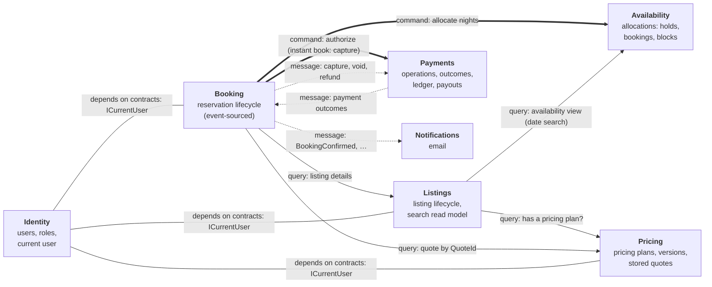
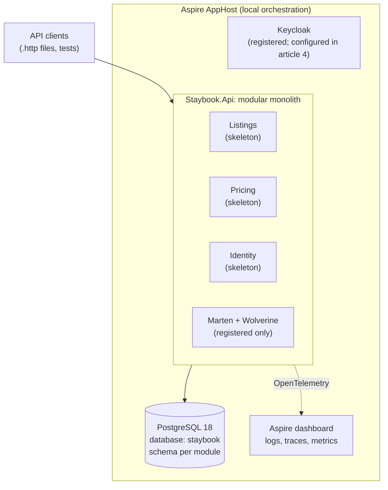

# Staybook architecture

This file holds the context map and the architecture diagram. The diagram grows with the series: each article that changes the architecture updates it and notes what was added.

## Context map

Staybook's bounded contexts and how they talk to each other: the target for the whole series. Arrows for modules that don't exist yet are refined by the article that builds them. Every arrow is one of the three allowed forms (plan section 7):

- **query** — synchronous read through the other module's Contracts
- **command** — synchronous call through Contracts, **only** for steps the user waits for, always with a stable operation ID
- **message** — asynchronous, through Wolverine

The plain lines from Identity are not communication: they show that modules depend on Identity's contracts (`ICurrentUser`).

| Module | Owns | Schema | Introduced |
|---|---|---|---|
| Listings | Listing lifecycle, house rules, search read model | `listings` | Skeleton in 1; domain in 2; application in 3 |
| Pricing | Pricing plans and versions, fees, stored quotes | `pricing` | Skeleton in 1; domain in 2; application in 3 |
| Identity | Users and roles, the current-user abstraction | `identity` | Skeleton in 1; implemented in 4 |
| Booking | Reservation lifecycle (event-sourced) | `booking` | 5 |
| Payments | Payment operations and outcomes, records, ledger | `payments` | 5, 8 to 10 |
| Availability | Allocations: the only source of truth for dates | `availability` | 6 |
| Notifications | Email to guests and hosts | `notifications` | 7; extracted in 11 |

**Relationship notes:**

- **Listings → Pricing** is a query, not a shared transaction. The race between the check and publication is accepted, tested and documented (article 3).
- **Booking → Availability and Payments** are the only synchronous commands, because the guest is waiting for the answer. For instant book, the capture is synchronous too (decision 23). They carry operation IDs so a retry after a lost response is safe (articles 5, 6, 8).
- **Listings → Availability** serves search by dates from Availability's view. The view may be stale; allocation is the real check. Article 6 settles the exact mechanism.
- **Identity** is upstream of everyone: modules depend on its contracts (`ICurrentUser`), never on Keycloak or raw claims (article 4).

## Architecture diagram

### v1: after article 1

**Added in article 1:** the modular monolith with three module skeletons, PostgreSQL through Aspire, Marten and Wolverine registered, Keycloak registered but not used, OpenTelemetry to the Aspire dashboard, and architecture tests enforcing the boundaries.
