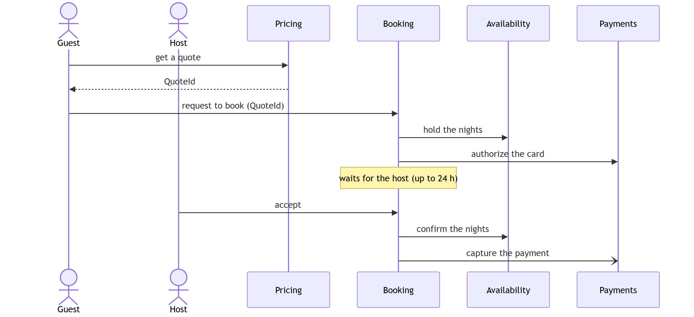
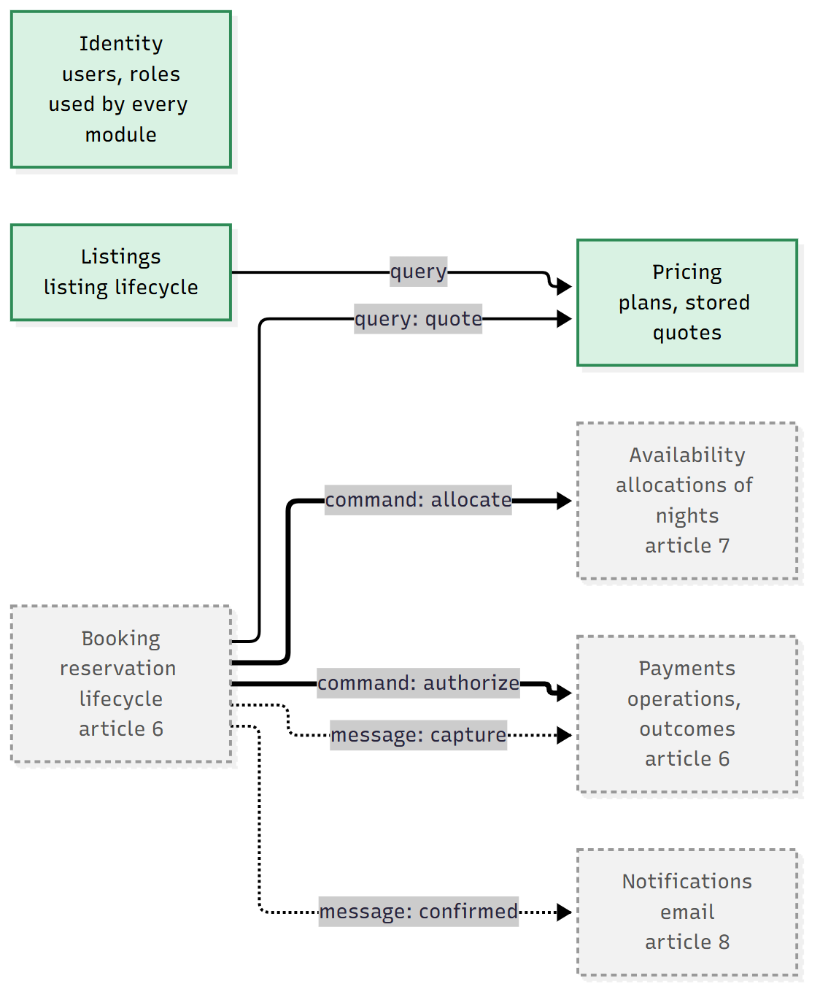
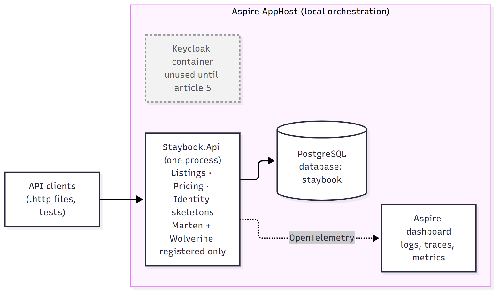

# Designing and setting up Staybook

*Staybook, part 1 of 14 · Code: tag [`article-01`](https://github.com/Alimurrazi/staybook-dotnet-reference-architecture/tree/article-01) · Full details: [article 1 report](https://github.com/Alimurrazi/staybook-dotnet-reference-architecture/blob/article-01/docs/reports/article-01-designing-and-setting-up-staybook.md)*

In this series we build **Staybook**, a simplified vacation rental backend inspired by Airbnb, in ASP.NET Core 10. Guests find listings, get a price, book nights and pay; hosts publish listings and accept requests. That one familiar domain is the thread through the whole journey: along the way we learn and use the tools and architecture patterns a real system like this needs, from Clean Architecture and CQRS to event sourcing, reliable messaging, sagas, payments and security.

This first article designs Staybook and sets up a solution you can clone, run and test, with its boundaries enforced from the first commit.

## The tools

These are the main tools in this article. Each line says what the tool is and what Staybook uses it for; the links go to the official sites if you want to learn more.

- **[ASP.NET Core 10](https://dotnet.microsoft.com/apps/aspnet)**: Microsoft's framework for building web APIs in C#. Staybook's whole backend is one ASP.NET Core application.
- **[PostgreSQL](https://www.postgresql.org/)**: an open-source relational database. Staybook keeps all its data in one PostgreSQL database, with a separate schema for each module.
- **[Marten](https://martendb.io/)**: a .NET library that turns PostgreSQL into a document database and an event store. Staybook uses it to store documents such as listings and quotes, and later the events of each booking.
- **[Wolverine](https://wolverinefx.net/)**: a .NET library for handling commands and messages. Staybook uses it for its handlers, and later for reliable messaging, the outbox and sagas.
- **[Aspire](https://aspire.dev/)**: a tool for running an application with everything it depends on. One command starts PostgreSQL and Keycloak in Docker, connects the API to them and opens a dashboard.
- **[OpenTelemetry](https://opentelemetry.io/)**: an open standard for logs, traces and metrics. Staybook sends them to the Aspire dashboard, so you can see what each request did.
- **[Keycloak](https://www.keycloak.org/)**: an open-source login and identity server. It's started now but used only from article 4, for authentication.
- **[ArchUnitNET](https://github.com/TNG/ArchUnitNET)**: a library for writing tests about the code's structure. Staybook's architecture tests use it to check the module and layer rules.

## What this article builds, and what comes later

**What exists after this article:**

- three module skeletons: Listings, Pricing and Identity;
- Marten, Wolverine and PostgreSQL, registered but not used yet;
- OpenTelemetry, with logs and traces in the Aspire dashboard;
- health endpoints;
- 37 architecture tests.

**What comes later:**

- article 3: the first business endpoints;
- article 4: authentication with Keycloak;
- article 5: event-sourced bookings;
- article 6: allocations that make double booking impossible;
- article 7: the outbox;
- article 8: sagas.

So after the setup commands you get a running, observable, well-guarded skeleton, not a booking API. That comes over the next few articles.

> **A note on the plan.** The article order, the module boundaries and the architecture in this article are my initial plan. Some of it will probably change as development goes on and the code teaches me something the plan didn't foresee. When that happens, the article that makes the change will say what changed and why, and the decision records in `docs/adr/` will be updated with it.

## Why a rental platform

The rental flow is familiar, but Staybook makes its rules explicit: a booking is either instant or needs the host's approval, a pending request holds the nights for up to 24 hours, and every booking uses a quote the server stored. Those rules lead straight to the hard parts:

- **Availability:** two guests book the same nights at the same moment. Exactly one must win.
- **Money:** every cent must add up, and a price a guest was quoted must never change.
- **Time:** a booking request waits up to 24 hours while the nights are on hold and the card is authorized.
- **Failure:** the payment provider times out. Did the charge happen? A timeout doesn't prove a failure; the outcome is *unknown*.

Everything else is deliberately small. No photos, no chat, no wishlists, no frontend. Every feature has to teach something.

Staybook is a **production-oriented reference architecture**, not a platform you could run a business on. No real money moves, there are no backups, and nothing has had a legal or security audit. Saying so up front keeps the rest honest.

## Finding the boundaries

Instead of drawing boxes, walk through one scenario: *a guest requests a stay, the host accepts, the payment is captured.*

[](images/article-01/booking-flow.png)

Watch where the vocabulary changes:

1. The guest finds a **listing**: a property a host offers, with a title, a city, a capacity and house rules. A new listing has the status **Draft**; guests can book it only after the host publishes it. That's **listings**.
2. The guest asks for a price for their dates and number of guests. The server calculates it from the host's **pricing plan** (rates, fees and discounts), rounds every line to whole cents, and saves the result as a **quote**. If the host changes the plan later, the quote keeps its price; only new quotes use the new prices. That's **pricing**.
3. The guest requests to book with the quote's ID (never a price). The nights go on **hold** (**availability**), the card is **authorized** (**payments**), and the request is recorded (**booking**).
4. The host accepts: the hold becomes a confirmed allocation, then the money is captured.
5. Both get an email (**notifications**), and someone is always a guest or a host (**identity**).

Each place where the words, the rules or the owner change is a likely boundary between two modules. That gives seven modules. They are my starting design: if building a workflow shows that a boundary is wrong, it will change.

Booking and Availability can look like one module, but they do different jobs. **Booking** follows a reservation from the request to the end: waiting for the host, confirmed, cancelled or expired. **Availability** only decides which nights are taken, and makes sure two guests can never get the same night.

Only three modules exist today: Listings, Pricing and Identity. The other four arrive in the articles that need them:

[](images/article-01/context-map.png)

*Target architecture across the series. Green modules exist after article 1; dashed ones arrive later. Solid arrows are queries, thick arrows synchronous commands, dotted arrows messages.*

## Three ways to talk

Modules communicate in exactly three ways:

| Form              | What it means                                                      | When                                                 | Example                                                                                                             |
| ----------------- | ------------------------------------------------------------------ | ---------------------------------------------------- | ------------------------------------------------------------------------------------------------------------------- |
| **Query**   | "Give me some data." The caller waits; nothing changes             | Reading another module's data                        | Booking reads a quote from Pricing                                                                                  |
| **Command** | "Do this now." The caller waits for the result                     | **Only** when a user is waiting for the answer | Only two in Staybook: Booking asks Availability to allocate nights, and Payments to authorize the card              |
| **Message** | "Do this when you can" or "this happened." The sender doesn't wait | Everything else                                      | After the host accepts, Booking sends`CapturePayment`; when a booking is confirmed, Notifications sends the email |

All three go through the other module's **Contracts** project, its small public part. Since every module runs in the same application, a query or command is a plain C# method call.

A command can succeed while its reply is lost, so it carries a unique **operation ID**. If the caller retries with the same ID, the other module recognizes it and doesn't do the work twice.

## Not everything has to be right immediately

Availability must reject overlapping active allocations for the same listing; article 6 enforces that with a PostgreSQL exclusion constraint. Search results and emails can tolerate delayed updates. And money can never be atomic with an external provider, so the design records the intent first and resolves the outcome after.

Two rules come out of that, and they hold for the whole series: **a view never decides availability or money**, and **a provider timeout is never treated as a failure**: its outcome is unknown until resolved.

## A modular monolith

Seven modules sound like seven microservices. They aren't, yet. Staybook is one application with one PostgreSQL database and hard boundaries inside it:

- modules reference each other only through **Contracts** projects;
- **architecture tests** check project references and type dependencies, and fail the test run when a boundary is crossed;
- every module will own its own PostgreSQL schema, and no module reads another's tables. Today the schema names are declared; persistence isolation arrives as the modules gain storage.

Here's what actually runs after article 1:

[](images/article-01/runtime.png)

*What runs after article 1.*

Microservices would turn every boundary into a network call and a deployment before we know the boundaries are right. When there's a real reason to split, in article 11, the boundaries will already be there.

Each decision has a one-page record in `docs/adr/`: the modular monolith, the project structure, Wolverine instead of MediatR, Marten on PostgreSQL, and logging through `ILogger` with OpenTelemetry.

## The setup, in decisions

```
src/
  Staybook.AppHost/          Aspire: PostgreSQL, Keycloak, the API
  Staybook.ServiceDefaults/  OpenTelemetry and health checks
  Staybook.Api/              Composition root, no business logic
  Staybook.SharedKernel/     Shared types, kept small
  Modules/<Module>/
    Staybook.<Module>/            Domain/ Application/ Infrastructure/ Endpoints/
    Staybook.<Module>.Contracts/  The only part other modules may use
tests/Staybook.ArchitectureTests/
```

What each part is for:

- **`Staybook.AppHost`**: the Aspire project you run locally. It starts PostgreSQL and Keycloak in Docker and then starts the API connected to them.
- **`Staybook.ServiceDefaults`**: setup every service shares: OpenTelemetry and health checks.
- **`Staybook.Api`**: the application that actually runs. It only wires things together and registers the modules; it holds no business rules itself.
- **`Staybook.SharedKernel`**: a few small types every module needs, such as `Money` and `DateRange` (from article 2). Kept small on purpose, because every module depends on it.
- **`Modules/<Module>/Staybook.<Module>`**: one module's private code, in four folders:
  - `Domain/`: the business rules, such as when a listing can be published or how a price is calculated;
  - `Application/`: the use cases, such as "create a listing", which load data, call the domain and save the result;
  - `Infrastructure/`: database and other technical details;
  - `Endpoints/`: the HTTP API for this module.
- **`Modules/<Module>/Staybook.<Module>.Contracts`**: the module's public part: the interfaces and data other modules may use.
- **`tests/Staybook.ArchitectureTests`**: the tests that check the rules above. From article 2, each module also gets its own unit and integration tests in `tests/Modules/<Module>.Tests/`.

The tools are chosen for where the series goes: together, Marten and Wolverine give us documents, events, messaging and sagas on the same PostgreSQL database, so later articles never need a second one.

The composition root shows how the folders become a running application. The host wires infrastructure and lists the modules; each module registers its own services:

```csharp
var builder = WebApplication.CreateBuilder(args);

builder.AddServiceDefaults();
builder.AddNpgsqlDataSource("staybook");

// Registered only. Modules add their documents from article 3.
builder.Services.AddMarten(_ => { }).UseNpgsqlDataSource();
builder.Host.UseWolverine();

builder.AddIdentityModule();
builder.AddListingsModule();
builder.AddPricingModule();

var app = builder.Build();
app.MapDefaultEndpoints();
app.MapIdentityEndpoints();
app.MapListingsEndpoints();
app.MapPricingEndpoints();
app.Run();
```

- **A strict build.** Warnings are errors (except NuGet vulnerability advisories, so a new advisory can't break an old tag), recommended analyzers are on, style rules run in the build, and package versions live in one file.
- **One command to run it.** `dotnet run --project src/Staybook.AppHost` starts PostgreSQL and Keycloak in Docker, wires the connection string and opens a dashboard with logs, traces and metrics.
- **Registered, not configured.** Marten and Wolverine are registered, but nothing uses them until article 3. Infrastructure arrives when it pays for itself.

Running the app, not just building it, mattered: the API compiled fine but crashed at startup. In Wolverine 6's default dynamic code-generation mode, the API needs the separate `WolverineFx.RuntimeCompilation` package to start. A passing build proves the code compiles, not that the application starts.

## Tests that check themselves

Article 1 has no business logic, but it has **37 architecture tests**. They fail the test run when someone breaks one of these rules:

- a module uses another module only through its **Contracts** project, never its private code;
- the **domain** (the business rules) is plain C#, with no database, web or logging frameworks;
- dependencies point **inward**: endpoints → application → domain, never the other way;
- the **shared kernel**, the small project every module uses for types like `Money`, depends on no module and no framework.

Several of those layer rules have no production types to inspect yet. They set the constraints for later articles, and they're written to pass on an empty layer rather than fail.

## Built with Claude Code

Staybook is built with Claude Code, and the harness that keeps it on track (`CLAUDE.md` files, permissions, hooks, skills and subagents) is part of the repo. It gets its own article: [Building Staybook with Claude Code](https://github.com/Alimurrazi/staybook-dotnet-reference-architecture/blob/article-01/docs/articles/article-01b-claude-draft.md).

## Try it

You need the .NET 10 SDK (10.0.100 or later) and Docker, running.

```bash
git clone https://github.com/Alimurrazi/staybook-dotnet-reference-architecture.git
cd staybook-dotnet-reference-architecture
git checkout article-01
dotnet test --solution Staybook.slnx    # Debug, the default; the architecture tests need it
dotnet run --project src/Staybook.AppHost
```

37 tests pass, and `http://localhost:5174/health` answers `Healthy`. That endpoint includes the PostgreSQL check and is mapped only in Development. Then break something: reference `Staybook.Pricing` from Listings, use one of its types, and watch the tests name the violation.

**Next:** article 2 models the domain: money that never loses a cent, a listing with a real lifecycle, and quotes that never change. Pure C#, no database, every rule a test.
