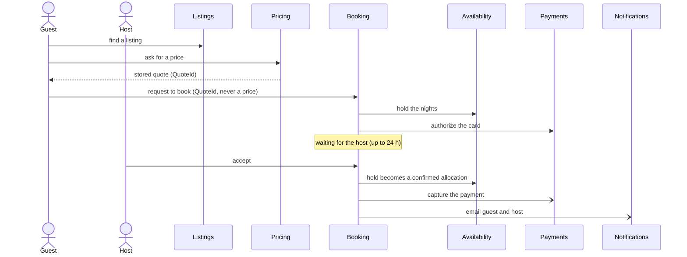
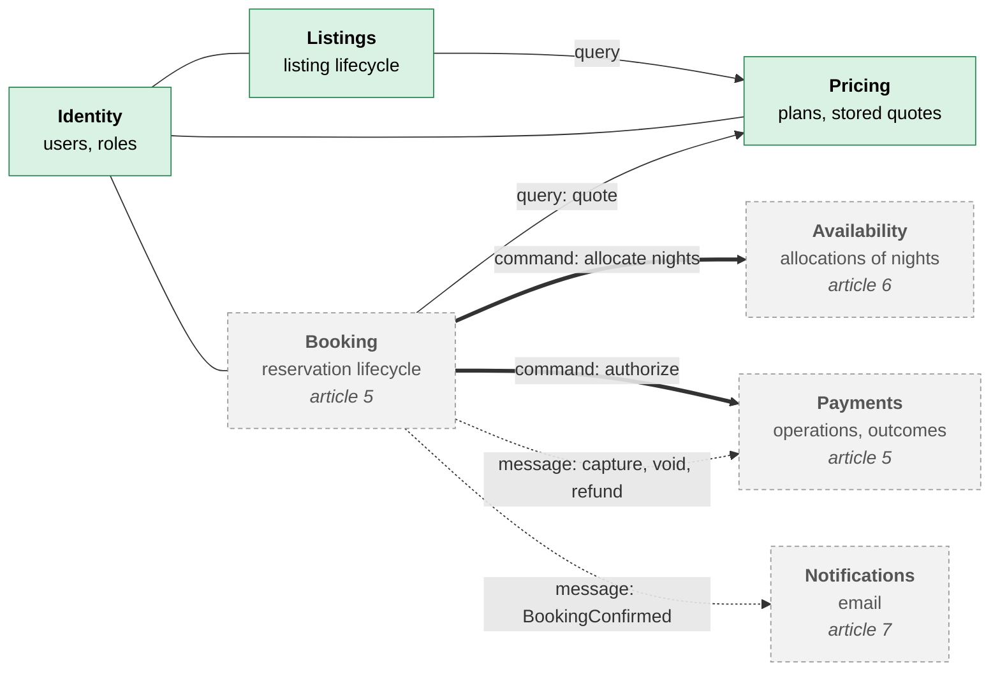
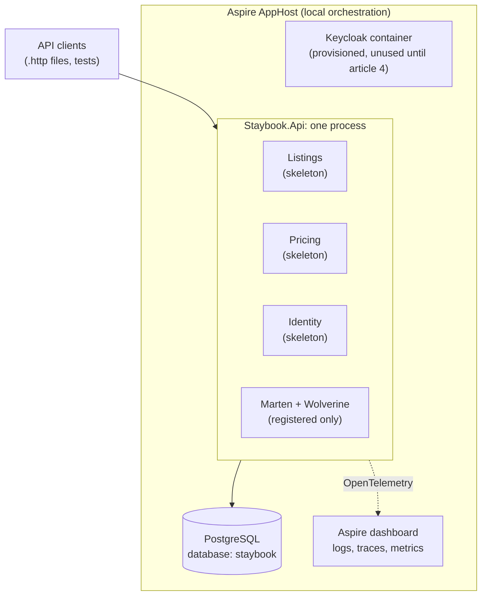

# Designing and setting up Staybook

*Staybook, part 1 of 14 · Code: tag [`article-01`](https://github.com/Alimurrazi/staybook-dotnet-reference-architecture/tree/article-01) · Full details: [article 1 report](https://github.com/Alimurrazi/staybook-dotnet-reference-architecture/blob/article-01/docs/reports/article-01-designing-and-setting-up-staybook.md)*

In this series we build **Staybook**, a simplified vacation rental backend inspired by Airbnb, in ASP.NET Core 10. Guests find listings, get a price, book nights and pay; hosts publish listings and accept requests. That one familiar domain is the thread through the whole journey: along the way we learn and use the tools and architecture patterns a real system like this needs, from Clean Architecture and CQRS to event sourcing, reliable messaging, sagas, payments and security.

This first article designs Staybook and sets up a solution you can clone, run and test, with its boundaries enforced from the first commit.

| Today (article 1)                                      | Later                                                |
| ------------------------------------------------------ | ---------------------------------------------------- |
| Three module skeletons: Listings, Pricing, Identity    | Business endpoints (article 3)                       |
| Marten, Wolverine and PostgreSQL registered            | Authentication with Keycloak (article 4)             |
| OpenTelemetry, logs and traces in the Aspire dashboard | Event-sourced bookings (article 5)                   |
| Health endpoints                                       | Allocations and the exclusion constraint (article 6) |
| 37 architecture tests                                  | Outbox (article 7), sagas (article 8)                |

So after the setup commands you get a running, observable, well-guarded skeleton, not a booking API. That comes over the next few articles.

> **A note on the plan.** The article order, the module boundaries and the architecture in this article are my initial plan. Some of it will probably change as development goes on and the code teaches me something the plan didn't foresee. When that happens, the article that makes the change will say what changed and why, and the decision records in `docs/adr/` will be updated with it.

## Why a rental platform

The rental flow is familiar, but Staybook makes its rules explicit: a booking is either instant or needs the host's approval, a pending request holds the nights for up to 24 hours, and every booking uses a quote the server stored. Those rules lead straight to the hard parts:

- **Availability:** two guests book the same nights at the same moment. Exactly one must win.
- **Money:** every cent must add up, and a price a guest was quoted must never change.
- **Time:** a booking request waits up to 24 hours while the nights are on hold and the card is authorized.
- **Failure:** the payment provider times out. Did the charge happen? A timeout doesn't prove a failure; the outcome is *unknown*.

Everything else is deliberately small. No photos, no chat, no wishlists, no frontend. Every feature has to teach something.

Staybook is a **production-oriented reference architecture**, not a platform you could run a business on. No real money moves, there are no backups, and nothing has had a legal or security audit. Saying so up front keeps the rest honest.

## Finding the boundaries

Instead of drawing boxes, walk through one scenario: *a guest requests a stay, the host accepts, the payment is captured.*



Watch where the vocabulary changes:

1. The guest finds a **listing**: details, a lifecycle, draft or published.
2. They ask for a price. Rates, fees, discounts, rounding and a stored, immutable **quote** are a different language that changes for different reasons. That's **pricing**.
3. They request to book with the quote's ID (never a price). The nights go on **hold** (**availability**), the card is **authorized** (**payments**), and the request is recorded (**booking**).
4. The host accepts: the hold becomes a confirmed allocation, then the money is captured.
5. Both get an email (**notifications**), and someone is always a guest or a host (**identity**).

Each change in vocabulary, rules and ownership suggests a boundary. That gives seven candidate modules, and the series tests them as the workflows take shape. The split that surprises people is Booking and Availability: **Booking owns the reservation lifecycle; Availability owns the exclusive allocation of nights.** A booking can be pending, accepted, cancelled or expired; Availability only cares that no two active allocations overlap.

Only three modules exist today (Listings, Pricing and Identity), because the others arrive in the articles that need them:



*Target architecture across the series. Green modules exist after article 1; dashed ones arrive later. Solid arrows are queries, thick arrows synchronous commands, dotted arrows messages.*

## Three ways to talk

Modules communicate in exactly three ways:

| Form                                                 | When                                                                        | Example                                                     |
| ---------------------------------------------------- | --------------------------------------------------------------------------- | ----------------------------------------------------------- |
| **Query** through the other module's contracts | Reading its data                                                            | Booking reads a quote from Pricing                          |
| **Command** through its contracts              | **Only** for steps a user is waiting for, always with an operation ID | Booking asks Availability to allocate nights                |
| **Message**                                    | Everything else                                                             | Booking requests the payment capture after the host accepts |

In a modular monolith these synchronous calls are in-process method calls through a contracts interface, not HTTP requests.

The middle row is the one that spreads if you let it. Staybook allows synchronous commands in only two relationships: Booking calling Availability to allocate nights, and Booking calling Payments to authorize (and, for instant book, capture) a payment while the guest waits. Everything else is a message.

Because a call can succeed while its response is lost, each operation has a stable ID, and the receiving module records the operation and its outcome. A retry then finds the existing operation instead of repeating the side effect. For an allocation, that means getting the existing allocation back. For a payment, the recorded outcome may still be pending or unknown, and the design has to handle that honestly.

## Not everything has to be right immediately

Availability must reject overlapping active allocations for the same listing; article 6 enforces that with a PostgreSQL exclusion constraint. Search results and emails can tolerate delayed updates. And money can never be atomic with an external provider, so the design records the intent first and resolves the outcome after.

Two rules come out of that, and they hold for the whole series: **a view never decides availability or money**, and **a provider timeout is never treated as a failure**: its outcome is unknown until resolved.

## A modular monolith

Seven modules sound like seven microservices. They aren't, yet. Staybook is one application with one PostgreSQL database and hard boundaries inside it:

- modules reference each other only through **Contracts** projects;
- **architecture tests** check project references and type dependencies, and fail the test run when a boundary is crossed;
- every module will own its own PostgreSQL schema, and no module reads another's tables. Today the schema names are declared; persistence isolation arrives as the modules gain storage.

Here's what actually runs after article 1:



*What runs after article 1.*

Microservices would turn every boundary into a network call and a deployment before we know the boundaries are right. When there's a real reason to split, in article 11, the boundaries will already be there.

Each decision has a one-page record in `docs/adr/`: the modular monolith, the project structure, Wolverine instead of MediatR, Marten on PostgreSQL, and logging through `ILogger` with OpenTelemetry.

## The setup, in decisions

```
src/
  Staybook.AppHost/          Aspire: PostgreSQL, Keycloak, the API
  Staybook.ServiceDefaults/  OpenTelemetry and health checks
  Staybook.Api/              Composition root, no business logic
  Staybook.SharedKernel/     Shared types, kept small
  Modules/<Module>/          Staybook.<Module> + Staybook.<Module>.Contracts
tests/Staybook.ArchitectureTests/
```

The stack is chosen for where the series goes, not just for today. **Marten** stores documents now and event streams from article 5. **Wolverine** runs handlers from article 3 and durable messaging, the outbox and sagas later, all on the same PostgreSQL. **Aspire** makes the local dependencies reproducible with one command.

The composition root shows how the folders become a running application. The host wires infrastructure and lists the modules; each module registers its own services:

```csharp
var builder = WebApplication.CreateBuilder(args);

builder.AddServiceDefaults();
builder.AddNpgsqlDataSource("staybook");

// Registered only. Modules add their documents from article 3.
builder.Services.AddMarten(_ => { }).UseNpgsqlDataSource();
builder.Host.UseWolverine();

builder.AddIdentityModule();
builder.AddListingsModule();
builder.AddPricingModule();

var app = builder.Build();
app.MapDefaultEndpoints();
app.MapIdentityEndpoints();
app.MapListingsEndpoints();
app.MapPricingEndpoints();
app.Run();
```

- **A strict build.** Warnings are errors (except NuGet vulnerability advisories, so a new advisory can't break an old tag), recommended analyzers are on, style rules run in the build, and package versions live in one file.
- **One command to run it.** `dotnet run --project src/Staybook.AppHost` starts PostgreSQL and Keycloak in Docker, wires the connection string and opens a dashboard with logs, traces and metrics.
- **Registered, not configured.** Marten and Wolverine are registered, but nothing uses them until article 3. Infrastructure arrives when it pays for itself.

Running the app, not just building it, mattered: the API compiled fine but crashed at startup. In Wolverine 6's default dynamic code-generation mode, the API needs the separate `WolverineFx.RuntimeCompilation` package to start. A passing build proves the code compiles, not that the application starts.

## Tests that check themselves

Article 1 has no business logic, but it has **37 architecture tests**: modules use each other only through contracts, the domain uses none of the listed infrastructure frameworks, layers point inward, and the shared kernel depends on no module and no infrastructure framework.

Several of those layer rules have no production types to inspect yet. They set the constraints for later articles, and they're written to pass on an empty layer rather than fail.

The interesting part is a bug. ArchUnitNET 0.13.4, the version we pin, loses dependencies inside `async` methods in **Release** builds (issue [#498](https://github.com/TNG/ArchUnitNET/issues/498)). Our handlers will be async, so the boundary tests could pass while seeing nothing. So the tests check themselves. A **canary** hides a dependency inside an async method:

```csharp
public static class AsyncCanary
{
    public static async Task<int> UseForbiddenDependencyAsync()
    {
        await Task.Yield();
        return ForbiddenDependency.Value;
    }
}
```

and a test asserts that the analyzer sees it:

```csharp
Types().That().Are(typeof(AsyncCanary))
    .Should().DependOnAny(Types().That().Are(typeof(ForbiddenDependency)))
    .Check(architecture);
```

The rule is **positive** on purpose. Asserting that a "must not depend" rule fails would also succeed if the canary type stopped matching at all. This rule passes only if the canary is found *and* its dependency is seen. A second guard fails if the tests run against an optimized build.

In Debug, all 37 pass. In Release, the guard and the canary fail, exactly as they should. The canary proves the analyzer can see the kind of dependency in our example; it doesn't prove every rule is right, which is what the rules' own tests are for.

A second surprise came from review. Reading a `const` from another module leaves no trace in the compiled code, because the compiler copies the value. The type rules can't see that, so one more test reads the project files and rejects forbidden references directly. The type rules catch what the code *uses*; that test catches what the project *may* use.

## Built with Claude Code

Staybook is built with Claude Code, and the harness that keeps it on track (`CLAUDE.md` files, permissions, hooks, skills and subagents) is part of the repo. It gets its own article: [Building Staybook with Claude Code](https://github.com/Alimurrazi/staybook-dotnet-reference-architecture/blob/article-01/docs/articles/article-01b-claude-draft.md).

## Try it

You need the .NET 10 SDK (10.0.100 or later) and Docker, running.

```bash
git clone https://github.com/Alimurrazi/staybook-dotnet-reference-architecture.git
cd staybook-dotnet-reference-architecture
git checkout article-01
dotnet test --solution Staybook.slnx    # Debug, the default; the architecture tests need it
dotnet run --project src/Staybook.AppHost
```

37 tests pass, and `http://localhost:5174/health` answers `Healthy`. That endpoint includes the PostgreSQL check and is mapped only in Development. Then break something: reference `Staybook.Pricing` from Listings, use one of its types, and watch the tests name the violation.

**Next:** article 2 models the domain: money that never loses a cent, a listing with a real lifecycle, and quotes that never change. Pure C#, no database, every rule a test.
