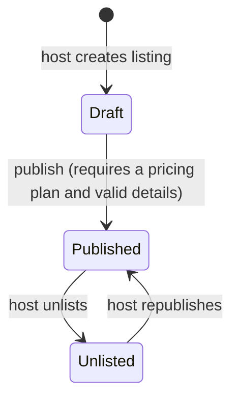
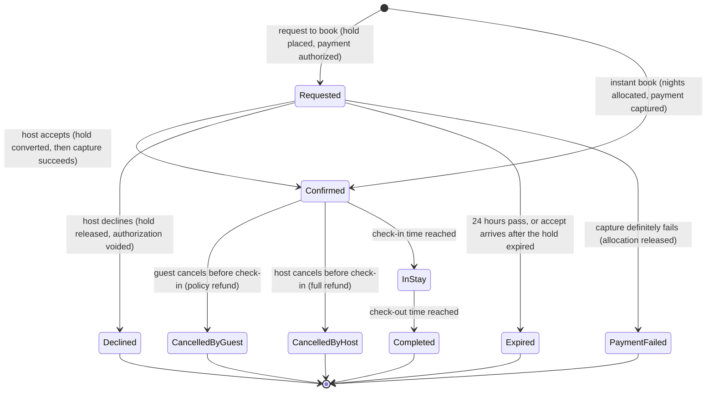
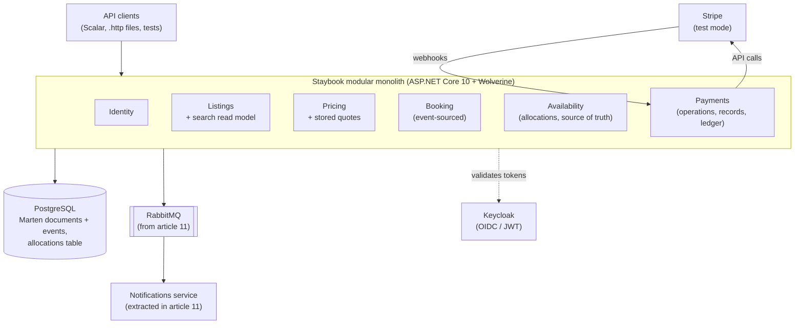
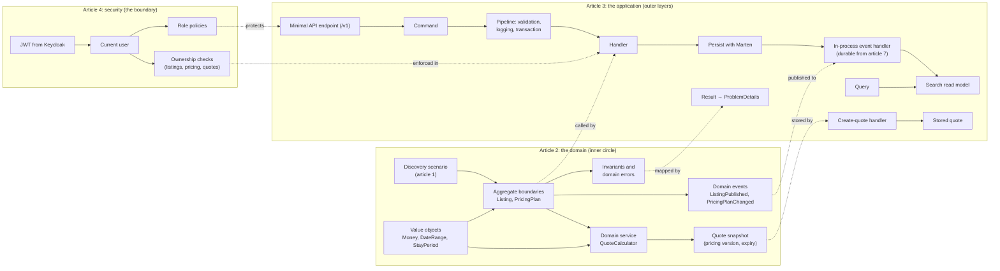
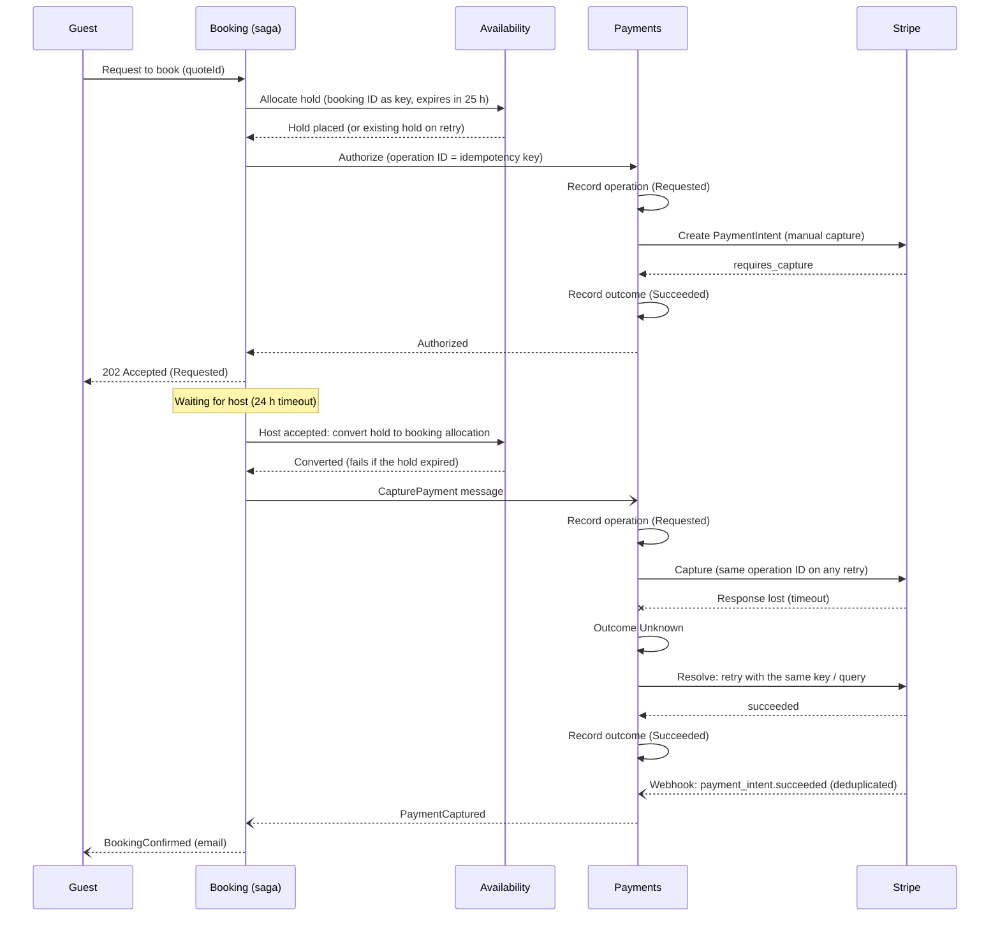

# Staybook: .NET Article Series Plan

*As of 2026-10-05 · Name: "Staybook" · Repo: `staybook-dotnet-reference-architecture` · Revised after three draft reviews*

A 14-article series in four phases that builds an **Airbnb-style vacation rental backend** with ASP.NET Core 10. It is a **production-oriented reference architecture**: it shows how a simple rental application evolves when it meets real problems (concurrency, consistency, external failures, financial correctness and security), and which architectural decisions those problems justify.

**Staybook teaches when and why to introduce architectural patterns.** A proposed companion series (section 15) would teach how to make one especially difficult part, payments, truly reliable.

---

## Table of contents

1. [Overview](#1-overview)
2. [Decisions made so far](#2-decisions-made-so-far)
3. [Starting point: the reference repo](#3-starting-point-the-reference-repo)
4. [The product](#4-the-product)
5. [The domain](#5-the-domain)
6. [Consistency boundaries and failure scenarios](#6-consistency-boundaries-and-failure-scenarios)
7. [Architecture and tech stack](#7-architecture-and-tech-stack)
8. [Series format and publishing](#8-series-format-and-publishing)
9. [Article-by-article plan](#9-article-by-article-plan)
10. [Payments deep dive](#10-payments-deep-dive)
11. [Testing strategy](#11-testing-strategy)
12. [Claude Code harness](#12-claude-code-harness)
13. [Out of scope and limitations](#13-out-of-scope-and-limitations)
14. [Risks, tips and next steps](#14-risks-tips-and-next-steps)
15. [Proposed companion series: Engineering Reliable Payments with .NET](#15-proposed-companion-series-engineering-reliable-payments-with-net)
16. [Sources and items to verify](#16-sources-and-items-to-verify)

---

## 1. Overview

**Goal:** a series where every pattern exists because the domain needs it, with the trade-offs explained. It is a guide to making sound architectural decisions, not a showcase of how many technologies fit into one .NET application.

**Positioning:** "production-oriented reference architecture", not "production-grade platform". A real rental platform would also need operational recovery, regulatory compliance and real payment settlement, which this series intentionally leaves out (see section 13).

**Audience:** .NET developers who know ASP.NET Core basics and want to see Clean Architecture, CQRS, security, event sourcing, reliable messaging and payments applied to one coherent codebase.

**Why an Airbnb-style product:** almost everyone knows how Airbnb works, so readers understand the requirements without explanation. Its core problems (availability, double booking, money, a booking lifecycle with many states, external payments) create genuine architectural pressure.

### The series at a glance

| Phase | # | Article |
|---|---|---|
| **1. Build a secure foundation** | 1 | Designing and setting up Staybook |
| | 2 | Domain modeling with DDD |
| | 3 | CQRS and the application layer |
| | 4 | Authentication and authorization |
| **2. Solve the booking problem** | 5 | Event sourcing with Marten |
| | 6 | Availability and concurrency |
| | 7 | Reliable messaging with Wolverine |
| | 8 | Reliable booking sagas |
| **3. Handle money and distributed failures** | 9 | Integrating Stripe safely |
| | 10 | Financial correctness, cancellations and reconciliation |
| | 11 | Distributed reliability and evolving the system |
| **4. Harden and evaluate the system** | 12 | Production-oriented API design |
| | 13 | Securing workflows: threat modeling and auditing |
| | 14 | End-to-end verification and architecture retrospective |
| **Bonus** (optional) | B1 | Double-blind reviews: a second timed saga |
| | B2 | Personal data in an immutable store: crypto-shredding and GDPR |

**Phase 1 is a complete "essentials" mini-series:** architecture, setup, DDD, CQRS and security. Readers who stop after Phase 1 still have a full, secured application slice.

Each phase ends with a working milestone, a GitHub release and a buffer week. Deployment (containers, CI/CD for deploys, hosting, backups) is a **separate future series**.

**The most distinctive articles** are 6 (double-booking prevention), 7 (reliable messaging), 8 (recovering from uncertain payment outcomes) and 9 to 10 (payment integration and financial correctness). They get the most space for failing scenarios, tests and alternative designs.

### Naive versions that later articles improve

Some articles start with the simple version most developers write first. Its weakness is **demonstrated by an isolated test**, named in "What can go wrong", and fixed in a later article. No version that handles real money (from article 9) contains any of these weaknesses.

| Naive version | Weakness, shown by a test | Improved in |
|---|---|---|
| Article 3: search updated by in-process events | A crash after saving loses a search update (read-only data) | Article 7: outbox |
| Article 5: instant book checks availability with check-then-insert against the booking projection | Two concurrent requests both pass the check | Article 6: allocations and the exclusion constraint |
| Article 5: instant book treats a payment timeout as a failure | The fake gateway authorized the payment but the response was lost; money is held with no booking | Article 8: resolving unknown outcomes |
| Article 5: instant book runs payment and booking in one request (fake gateway only) | A crash after capture leaves money taken with no booking | Article 8: instant book through a saga |

---

## 2. Decisions made so far

### Scope and positioning

| # | Decision | Reason |
|---|---|---|
| 1 | Start from an **empty repo**, not the reference repo | Its foundation would need rewriting; articles need a clean git history; the series should be clearly your own |
| 2 | Build an **Airbnb-style rental platform** | Widely known product; rich domain; real architectural problems |
| 3 | **Fully educational**, not for personal use | Only features that teach something are included |
| 4 | **Backend only** | Readers use the API through Scalar, `.http` files and tests |
| 5 | **Production-oriented reference architecture** | Honest about what an educational project can guarantee |
| 6 | **No photo uploads, no Claude product features** | Not essential to the core lessons |
| 7 | **Deployment in its own series** | Keeps this series focused on application architecture |
| 8 | **Double-blind reviews and crypto-shredding as bonus articles** | Valuable, but they teach less than the core path |
| 9 | **Companion payment series proposed, not committed**; decided after Phase 3 | A scope decision; avoids three overlapping series running at once |

### Series structure

| # | Decision | Reason |
|---|---|---|
| 10 | **14 articles in 4 phases** | Earlier 8-article plans overloaded several articles |
| 11 | **Design and setup merged into article 1**; setup shown as decisions, steps in the repo README | After slimming the setup, there wasn't enough for a separate article; readers finish article 1 with something runnable |
| 12 | **Authentication and authorization as article 4, in Phase 1**; threat modeling stays in article 13 | Security from the first release; workflow attacks need bookings and payments to exist |
| 13 | **Article 3 has no authentication**; article 4 secures it before the `phase-1` release | Keeps article 3 focused; no released version is unprotected |
| 14 | **Naive versions instead of missing safeguards** | Realistic "first versions", demonstrated by isolated tests; no weakness exists in code that handles real money |
| 15 | **Event versioning in article 11; cancellations in article 10** | Versioning needs real history; money rules belong together |
| 16 | **Caching is an optional section in article 3** | It doesn't establish the architectural foundation |
| 17 | **One article a week, buffer week between phases; passing tests are the release criteria, not the calendar** | Articles 6, 8, 9 and 10 are tight |

### Architecture

| # | Decision | Reason |
|---|---|---|
| 18 | **Modular monolith** with one extracted service (article 11) | Boundaries first; split when there is a reason |
| 19 | **Marten + Wolverine on PostgreSQL** | Real event sourcing, outbox and sagas in one database; replaces MediatR (commercial since 2025) |
| 20 | **Minimal infrastructure in article 1**: PostgreSQL, Marten and Wolverine registered, Keycloak registered only | Readers only set up what articles 2 and 3 use |
| 21 | **API conventions fixed in article 3, including a `/v1` prefix** | Later articles don't rewrite every route |
| 22 | **Search updated by Wolverine handlers consuming in-process domain events** (article 3); durable from article 7 | Listings and Pricing are documents, so Marten event projections don't apply |
| 23 | **Synchronous cross-module commands only where a user waits**: allocating nights and authorizing (or, for instant book, capturing) payment | Keeps the communication rule honest |
| 24 | **Durable local queues in article 7; RabbitMQ in article 11** with the Notifications extraction | Makes the extraction a real change |

### Consistency and data

| # | Decision | Reason |
|---|---|---|
| 25 | **Availability allocations are the single source of truth** for dates | Event streams record history; projections never decide availability |
| 26 | **Allocations accessed with Dapper; schema via DbUp; partial exclusion constraint** | Marten owns documents and events; the constraint table needs plain SQL |
| 27 | **Stable operation IDs: allocations are idempotent by booking ID** | A retried allocation after a lost response returns the existing allocation instead of conflicting with itself |
| 28 | **Hold expiry = request timeout + margin (24 h + 1 h); accepting converts the hold before capturing** | Prevents a capture without an allocation at the deadline |
| 29 | **Search by dates in article 6**, from an availability view that may be stale | Allocation is the real check |
| 30 | **Pricing versions and immutable, server-stored quote snapshots**; bookings reference a `QuoteId` | Price changes never alter existing quotes or bookings; clients never send prices |

### Payments

| # | Decision | Reason |
|---|---|---|
| 31 | **Payment boundary and fake gateway from article 5** | Bookings need payments before the Stripe article |
| 32 | **Durable payment operations: record the intent before calling the provider, record the outcome after** | Every provider call can be traced, retried with the same key and resolved |
| 33 | **Explicit outcomes: succeeded, failed, pending, unknown.** A timeout is not proof of failure | Prevents releasing a booking while money is actually held |
| 34 | **Resolve the original outcome before retrying or compensating** | Prevents double charges and wrong refunds |
| 35 | **Payment record + immutable ledger, written atomically**; Stripe calls stay outside the database transaction | The ledger is the financial history; event-sourced payments are noted, not implemented |
| 36 | **Processing fees in the ledger; settlement delays treated as pending in reconciliation** | Otherwise every payment shows up as a mismatch |
| 37 | **A failure simulator in the fake gateway** | Every failure scenario becomes an executable test |
| 38 | **Stripe in test mode, fake gateway as the default** | No real money or keys needed |

### Security, testing and workflow

| # | Decision | Reason |
|---|---|---|
| 39 | **Keycloak, JWT, role policies and resource-based ownership in article 4**, with seeded host, guest and admin users | Every Phase 1 endpoint is protected before release |
| 40 | **Auditing through a command audit trail for every module** (article 13) | Only Booking is event-sourced |
| 41 | **Testing inside every article, one tool per purpose** | Readers learn each technique where the code needs it |
| 42 | **Claude Code harness built completely in article 1 and explained in detail there** | Readers see exactly which harness is attached (`CLAUDE.md` files, permissions, hooks, skills, subagents, MCP) and why each piece exists; later articles mention it only where there is a real lesson |
| 43 | **Article 1 creates skeletons only for Listings, Pricing and Identity** | Booking and Payments are added in article 5, Availability in article 6, Notifications in article 7, so no module exists before the domain needs it |
| 44 | **Each article ships as a detailed report, a short article and the repo** (revised 2026-10-08) | After each article's development, Claude writes a full report in `docs/reports/article-NN-*.md` (every decision, test, mistake and fix). The author drafts the short published article from it; Claude also prepares a short draft (`docs/articles/article-NN-claude-draft.md`). The report is the complete record; the article is what readers read |
| 45 | **CI deferred to a follow-up** (author's decision, 2026-10-07) | Article 1 ships without a CI workflow. Until it exists, the Claude Code hooks (build after edits, affected tests before stopping) and local `dotnet test` are the only gates |
| 46 | **Logging through `ILogger` and OpenTelemetry, taught where it's needed** (author's decision, 2026-10-08): the decision in article 1 (ADR 5), conventions in 3, visibility of unknown outcomes in 8, correlation in 11, redaction in 13; FakeLogger, FakeTimeProvider and the redaction library approved | Logging has no Staybook problem of its own, so it gets no separate article; each part appears with the problem that needs it. Production log storage belongs to the deployment series |

---

## 3. Starting point: the reference repo

The jeangatto repo ([ASP.NET-Core-Clean-Architecture-CQRS-Event-Sourcing](https://github.com/jeangatto/ASP.NET-Core-Clean-Architecture-CQRS-Event-Sourcing)) is a good Clean Architecture and CQRS sample, but its event sourcing is really an audit log. (The reviews confirmed these claims against the code.)

**What it is:** a .NET 10 API with one `Customer` aggregate (create, update, delete, read). Writes go to SQL Server through EF Core; domain events are published with MediatR and projected into MongoDB; reads come from MongoDB behind a Redis cache.

| Pattern | Verdict | Why |
|---|---|---|
| Clean Architecture | Good, minor deviations | Layers and dependency direction are right. Migrations live in the API project; `Shop.Query` mixes read logic with MongoDB access; `Shop.Core` mixes the shared kernel with infrastructure helpers |
| CQRS | Good, but synchronization is unreliable | Separate commands, queries, models and databases. Events are published in-process after commit with no outbox |
| Event sourcing | Name only | The SQL `Customer` table is the source of truth. The `EventStore` table is written after commit and never replayed: no streams, versions, rehydration or snapshots |

**The flaw to use as a teaching example (article 7):** in `UnitOfWork.SaveChangesAsync` (`UnitOfWork.cs`, around lines 45 to 63), events are published and stored *after* `transaction.CommitAsync()`. If publishing fails, the catch block calls `RollbackAsync()` on a transaction that has already committed. The state change stays, but the read model and event log miss it.

**Worth borrowing as reference:** the transaction and execution-strategy handling in `UnitOfWork`, `ResultExtensions` (mapping results to HTTP responses), and the CI workflows (build, SonarCloud, CodeQL, DevSkim).

**Credit:** mention the repo as inspiration in article 1.

---

## 4. The product

An Airbnb-style vacation rental backend. Hosts list properties; guests search, book and pay; the platform takes fees and pays hosts.

The guiding rule: **resist adding product features.** The value of Staybook is showing how a simple application evolves under real pressure, not how many features it has.

### Features kept, and what each one teaches

| Feature | What it teaches | Article |
|---|---|---|
| Listings (title, city, capacity, house rules, check-in time, draft and published states) | Aggregates, lifecycle invariants, value objects | 2, 3 |
| Pricing (nightly rate, cleaning fee, weekly discount, minimum nights, versions) | `Money`, rounding, versioning, quote calculation | 2, 3 |
| Stored quote snapshots | Immutable snapshots; never trusting client prices | 2, 3, 4 |
| Search by city, guest count and price | A read model updated from domain events | 3 |
| Caching listing details and pricing plans (optional) | HybridCache and invalidation | 3 |
| Roles and ownership: guest, host, admin | Authentication, policies, resource-based authorization | 4 |
| Instant book | Event sourcing; the first booking path | 5 (through a saga in 8) |
| Availability calendar (holds, host blocks), search by dates | Concurrency, idempotent allocation, double-booking prevention | 6 |
| Email notifications | Outbox, integration events, retries, service extraction | 7, 11 |
| Request-to-book | Holds plus a 24-hour saga | 8 |
| Payments: fake gateway with a failure simulator, then Stripe test mode | Operation IDs, uncertain outcomes, webhooks, idempotency, resilience | 5, 8, 9 |
| Cancellation policies and refunds | Domain rules with time zones, refund postings, property tests | 10 |
| Host earnings ledger, simulated payouts, reconciliation | Double-entry ledger, processing fees, settlement delays | 10 |
| Double-blind reviews | A second timed saga | Bonus B1 |

### Features cut, and why

| Cut | Reason |
|---|---|
| Frontend, PWA, map search | The series is backend-focused |
| Listing photo uploads | Not essential to the core lessons |
| Host-guest chat (SignalR) | Real-time UI work with little architectural lesson |
| Wishlists, favorites | Plain CRUD, nothing new to learn |
| Co-hosts | Host vs guest already covers resource-based authorization |
| Geographic radius search (PostGIS) | City and date search teaches the same CQRS lesson |
| Weekend and seasonal pricing | One rule set is enough to teach value objects |
| Real payouts through Stripe Connect | Simulated payouts teach the ledger without Connect onboarding |
| Push notifications, digests | Email is enough to teach the outbox |
| Currency conversion, taxes, VAT | Large topics of their own; mentioned only |
| Cancellation after check-in | Out of scope; policies apply only before check-in |
| Claude MCP and AI features | Not core to the architecture |

### API surface (indicative)

All routes use the `/v1` prefix fixed in article 3 (omitted below for readability).

| Area | Endpoints | Article |
|---|---|---|
| Listings | `POST /listings`, `PUT /listings/{id}`, `POST /listings/{id}/publish`, `POST /listings/{id}/unlist`, `GET /listings/{id}` | 3 |
| Pricing | `PUT /listings/{id}/pricing` | 3 |
| Search and quotes | `GET /search?city=&guests=&maxPrice=`, `POST /listings/{id}/quotes` (stores a quote), `GET /quotes/{id}` | 3 |
| Security | All of the above protected by role and ownership; quotes owned by the requesting guest | 4 |
| Bookings | `POST /bookings` (instant book, with `quoteId`), `GET /bookings/{id}`, `GET /me/trips`, `GET /me/hosting/bookings` | 5 |
| Availability | `POST /listings/{id}/blocks`, `DELETE /listings/{id}/blocks/{blockId}`, `GET /listings/{id}/calendar`, search adds `&checkIn=&checkOut=` | 6 |
| Request-to-book | `POST /bookings` (request mode), `POST /bookings/{id}/accept`, `POST /bookings/{id}/decline` | 8 |
| Payments | `POST /webhooks/stripe` | 9 |
| Cancellation and finance | `POST /bookings/{id}/cancel`, `GET /me/earnings`, `GET /admin/reconciliation` | 10 |
| Admin | `GET /admin/dead-letters`, `POST /admin/dead-letters/{id}/replay`, `GET /admin/payment-operations?status=unknown` | 8, 11 |
| Reviews (bonus) | `POST /bookings/{id}/review`, `GET /listings/{id}/reviews` | B1 |

### Reader experience for every article

- A short README with prerequisites, step-by-step setup and the tag's known limitations.
- Seed data (sample host, guest and admin users, listings, bookings).
- Executable `.http` requests **with expected results**.
- Scalar for interactive API docs; the Aspire dashboard for logs, traces and metrics.

---

## 5. The domain

### Ubiquitous language

| Term | Meaning |
|---|---|
| Listing | A property a host offers for rent; starts as a draft and becomes bookable when published |
| Host | The user who owns a listing |
| Guest | The user who books a stay |
| Stay | A check-in date and check-out date; measured in **nights** |
| Check-in time | The listing's local check-in time (default 15:00); check-out time defaults to 11:00 |
| Pricing plan | A listing's nightly rate, cleaning fee, weekly discount and minimum nights |
| Pricing version | A number that increases with every pricing-plan change; identifies which rules produced a quote |
| Quote | A stored, immutable price calculation: listing, stay, guest count, line items, currency, pricing version, owner and expiry |
| Price snapshot | The quote a booking was made from; later price changes never affect it |
| Allocation | An authoritative claim on a listing's nights: a hold, a confirmed booking or a host block |
| Hold | An allocation that expires, placed while a booking request waits for the host |
| Block | Dates a host makes unavailable |
| Booking | A guest's reservation of a listing for a stay |
| Instant book | Booking confirmed without host approval |
| Request to book | Booking that waits up to 24 hours for host approval |
| Cancellation policy | Rules that decide the refund when a guest cancels |
| Payment operation | One call to the payment provider (authorize, capture, void, refund), recorded before the call with a stable ID |
| Outcome | The result of a payment operation: succeeded, failed, pending or **unknown** |
| Authorization | Money held on the guest's card, not yet taken |
| Capture | Taking authorized money |
| Void | Releasing an authorization without taking money |
| Payout | Money released to the host 24 hours after check-in |
| Ledger | The immutable, double-entry record of every money movement |

### Modules (bounded contexts)

| Module | Responsibility | Persistence | Introduced |
|---|---|---|---|
| Listings | Property details, house rules, listing lifecycle; owns the search read model | Documents + search document | 2, 3 |
| Pricing | Pricing plans and versions, fees, discounts, stored quotes | Documents + value objects | 2, 3 |
| Identity | Users (guest, host, admin), current-user abstraction | Keycloak + documents | 4 |
| Booking | Reservation lifecycle | **Event-sourced** | 5 |
| Payments | Payment operations and outcomes, payment records, gateway, ledger, payouts, reconciliation | Documents (operations, records) + immutable ledger | 5, 8, 9, 10 |
| Availability | Allocations per listing: holds, bookings, blocks; availability view for search | Relational table (Dapper) + **exclusion constraint** (source of truth) | 6 |
| Notifications | Email to guests and hosts | Documents; module in article 7, **extracted service in article 11** | 7, 11 |
| Reviews | Double-blind reviews | Documents + saga | Bonus B1 |

### Listing lifecycle



### Booking lifecycle



While a payment outcome is **unknown**, the booking stays in its current state and the saga resolves the outcome first (article 8).

**Booking events:** `BookingRequested`, `BookingAccepted`, `BookingDeclined`, `BookingExpired`, `BookingConfirmed`, `BookingPaymentFailed`, `BookingCancelledByGuest`, `BookingCancelledByHost`, `StayStarted`, `StayCompleted`.

### Business rules

**Listings:**

- A listing can be published only when it has a title, a city, a capacity of at least 1, a check-in time, a cancellation policy and a **pricing plan**.
- Only published listings appear in search and can be booked.
- Only the listing's host can edit, price, publish or unlist it (enforced from article 4).

**Quotes:**

- A quote is calculated and **stored by the server** with its line items, currency, pricing version and an expiry (for example 30 minutes).
- A quote is immutable. If the host changes the pricing plan, existing quotes keep their prices until they expire.
- From article 4, a quote belongs to the guest who requested it.
- A booking requires an **unexpired quote owned by the guest**, for the same listing and stay. The client never sends a price.

**Pricing (fee percentages are illustrative and configurable):**

Staybook uses Airbnb's **older split-fee model** (a guest fee plus a host fee). Airbnb has since moved most hosts to a single host-only fee of about 15.5%. The split model is kept on purpose: two fees teach more (the guest-pays identity, refunding the guest fee, recalculating the host fee on cancellation). Verified 2026-10-05; see `verification/article-01.md`.

- Every pricing-plan change increments the **pricing version**.
- Nights total = nights × nightly rate.
- **Weekly discount:** a percentage (for example 10%) of the nights total, for stays of 7 nights or more. Applied **before** the cleaning fee.
- Subtotal = nights total − weekly discount + cleaning fee.
- Guest service fee = 14% of subtotal, paid by the guest.
- Host fee = 3% of subtotal, deducted from the payout.
- **Rounding:** every percentage line is rounded to the currency's minor unit, half away from zero (`MidpointRounding.AwayFromZero`). Totals are sums of rounded lines.
- **Invariant by construction:** guest pays = host payout + platform revenue.

**Example 1 (EUR): the simple case**

| Line | Amount |
|---|---|
| 3 nights × 100.00 | 300.00 |
| Cleaning fee | 30.00 |
| **Subtotal** | **330.00** |
| Guest service fee (14%) | 46.20 |
| **Guest pays** | **376.20** |
| Host fee (3% of subtotal) | −9.90 |
| **Host payout** | **320.10** |
| **Platform revenue** (46.20 + 9.90) | **56.10** |

**Example 2 (EUR): rounding and the weekly discount**

| Line | Exact value | Rounded |
|---|---|---|
| 7 nights × 99.99 | 699.93 | 699.93 |
| Weekly discount (10% of nights total) | −69.993 | −69.99 |
| Nights after discount | | 629.94 |
| Cleaning fee | | 45.00 |
| **Subtotal** | | **674.94** |
| Guest service fee (14%) | 94.4916 | 94.49 |
| **Guest pays** | | **769.43** |
| Host fee (3% of subtotal) | −20.2482 | −20.25 |
| **Host payout** | | **654.69** |
| **Platform revenue** (94.49 + 20.25) | | **114.74** |

Check: 654.69 + 114.74 = 769.43. Property-based tests assert this identity for any input.

**Cancellation policies (simplified rules for this project, modeled on Airbnb's):**

These are deliberately simplified. Airbnb's current standard policies are Flexible, Moderate, Limited and Firm (Strict is invitation-only), its Moderate keeps one night plus 50% of the rest, and it adds a 24-hour grace period for bookings made 7 or more days ahead. None of that is modeled here; the article states it. Verified 2026-10-05.

Cutoffs are measured against the **check-in datetime in the listing's time zone** (check-in date + check-in time), compared with the current UTC time.

| Policy | Full refund | 50% refund of nights | No refund of nights |
|---|---|---|---|
| Flexible | ≥ 24 hours before check-in | — | Less than 24 hours before |
| Moderate | ≥ 5 days before check-in | ≥ 24 hours before | Less than 24 hours before |
| Strict | Within 48 hours of booking, if check-in is ≥ 14 days away | ≥ 7 days before | Less than 7 days before |

- "Nights" means nights after the weekly discount.
- The cleaning fee is always refunded if cancelled before check-in.
- The guest service fee is refunded only with a full refund.
- **The host fee is recalculated on the retained subtotal** (the part the host keeps).
- A host cancellation always gives the guest a full refund.
- **Cancellation is only possible before check-in.** Payouts happen 24 hours after check-in, so neither side can cancel after a payout.

**Availability:**

- **The Availability module's allocations are the only source of truth** for whether nights are free.
- Allocations are **idempotent by booking ID**: allocating again for the same booking returns the existing allocation.
- A requested booking places a **hold** that expires at request time + 25 hours (the 24-hour host window plus a 1-hour margin).
- Accepting a request **converts the hold into a booking allocation first**, and fails if the hold no longer exists. Only then is the payment captured.
- No two active allocations may overlap for the same listing; the database enforces this.
- Nights are counted as dates in the listing's time zone, not hours.

**Payouts:**

- Released **24 hours after check-in**, simulated as a ledger movement.
- The platform absorbs payment processing fees; they don't reduce the host payout.

---

## 6. Consistency boundaries and failure scenarios

This section is referenced throughout the series. Each article that introduces one of these operations explains its boundary and its failure handling with a test.

### Consistency boundaries

| Operation | Consistency | Mechanism | Article |
|---|---|---|---|
| Changing a listing or pricing plan | Immediate, within one aggregate | Document optimistic concurrency | 3 |
| "Publish requires a pricing plan" | Immediate check across modules (accepted small race, tested and documented) | Query through Pricing contracts | 3 |
| Creating a quote | Immediate; immutable afterwards | Stored document with pricing version | 3 |
| Search results | Eventual | In-process event handlers (article 3), durable from article 7 | 3, 7 |
| Search by dates | Eventual, may be stale | Availability view; the allocation is the real check | 6 |
| Appending to a booking stream | Immediate, within the stream | Stream version (optimistic concurrency) | 5 |
| Allocating nights | **Immediate and absolute**; idempotent by booking ID | Allocation + partial exclusion constraint | 6 |
| Allocating nights, authorizing payment | Immediate across modules (the user waits) | Synchronous calls through contracts | 5, 6, 8 |
| Capture, void, refund after the request | Eventual, with outcome resolution and compensation | Saga messages | 8, 9, 10 |
| Payment provider call ↔ database | **Cannot be atomic** | Operation recorded before the call; outcome resolved after | 5, 8, 9 |
| Payment record ↔ ledger postings | Immediate | Same database transaction | 10 |
| Guest trips, host calendar | Eventual | Async projections | 5 |
| Notifications | Eventual, at-least-once | Outbox + idempotent handler | 7 |
| Ledger ↔ Stripe | Eventual (nightly), allowing for fees and settlement delays | Reconciliation | 10 |

**Rules:**

- A projection or view is never used to decide anything that must be immediately correct (availability, money). Projections serve reads.
- A provider timeout is never treated as a failure. The outcome is **unknown** until resolved.

### Failure scenarios

| Scenario | What happens | Article |
|---|---|---|
| Pricing plan removed between the publish check and publication | Accepted race: the listing is published; a later quote fails clearly. Tested and documented | 3 |
| Search update lost because the process crashed after saving | Possible in article 3 (read-only data); impossible from article 7 (outbox) | 3, 7 |
| A guest reuses another guest's quote or an expired quote | Rejected: quotes are owned and expire | 4, 5 |
| Two guests book the same nights at the same moment | Naive check in article 5 lets both through (shown by a test); from article 6, the constraint lets exactly one allocation commit and the other gets `409 Conflict` | 5, 6 |
| Allocation succeeds but its response is lost; Booking retries | The allocation is idempotent by booking ID, so the retry returns the existing allocation | 6 |
| Crash after allocation, before the booking event is appended | The retry with the same booking ID reuses the allocation; if nothing retries, the hold expires and is swept | 6 |
| Search shows a listing as available but the nights were just taken | The booking fails at allocation with a clear conflict; search may be stale | 6 |
| A message handler runs twice | Handlers are idempotent; the inbox deduplicates | 7 |
| Authorization succeeds but the response is lost (timeout) | Article 5's naive version treats it as failure (shown by a test). From article 8, the outcome is **unknown**: the saga retries with the same idempotency key or queries the provider, then continues or voids | 5, 8 |
| Authorization is still pending when the host accepts | The saga waits for the authorization outcome (within the request window) before capturing | 8 |
| Host never responds | The 24-hour timeout expires the request, releases the hold, voids the authorization | 8 |
| Host accepts at the last second | Accept converts the hold first; if the hold is gone, accept fails and the request expires; no capture happens | 8 |
| Capture succeeds but the response is lost | Outcome unknown → resolved through the same idempotency key → recorded as captured; no second capture | 8, 9 |
| Crash after instant-book capture, before the booking is confirmed | Possible in article 5 (fake gateway only, shown by a test); from article 8 the saga completes the booking or refunds | 5, 8 |
| Payment provider unavailable during recovery | The operation stays unknown; recovery retries with backoff; after a threshold it appears in the admin list of unknown operations | 8, 9 |
| Void fails after a decline | Retried with backoff; the authorization also expires on its own after about 7 days; reconciliation checks it | 8, 9 |
| Compensation repeatedly fails | Retries, then dead-letter and the manual-intervention list; some failures need a human | 8, 11 |
| Webhook delayed | The API response drives the flow; the webhook confirms it; if neither arrives, the saga queries Stripe | 9 |
| Webhook duplicated or out of order | Inbox deduplicates by event ID; the payment state machine ignores stale transitions | 9 |
| Stripe unavailable when a guest requests to book | Circuit breaker opens. If the authorization was never sent, the hold is **explicitly released** and the guest gets "payment unavailable, try again". If it was sent and timed out, the outcome is unknown and is resolved first | 9 |
| Refund succeeds but the application crashes before recording it | The refund operation was recorded before the call; recovery resolves it through the same idempotency key and records it once | 10 |
| Refund definitely fails | Retried; after the limit, manual-intervention list; the ledger shows the amount in *Refunds payable* | 10 |
| Ledger and Stripe differ because of fees or settlement timing | Not a mismatch: fees are posted from the provider's data; unsettled funds are "pending settlement" | 10 |
| Ledger and Stripe genuinely disagree | Reconciliation reports the mismatch | 10 |
| A projection falls behind | Reads may be stale; lag is monitored; clients can wait for a version (read-your-writes) | 11, 12 |
| Notification service is down | Messages wait in RabbitMQ; bookings are unaffected | 11 |

---

## 7. Architecture and tech stack

### The architecture grows with the series

One diagram evolves through the series, so readers see why complexity is added:

| After article | Added to the diagram |
|---|---|
| 1 | Modular monolith, PostgreSQL, Marten and Wolverine registered, Keycloak registered |
| 3 | Search read model (in-process event handlers), stored quotes, optional cache |
| 4 | Keycloak configured, authorization policies |
| 5 | Event store (Booking streams), payment boundary with operation records and the fake gateway |
| 6 | Availability allocations with the exclusion constraint; availability view for search |
| 7 | Outbox, inbox, durable local queues, Notifications module, Mailpit |
| 8 | Sagas, scheduled messages, payment outcome recovery |
| 9 | Stripe (test mode) and webhooks |
| 10 | Ledger and reconciliation job |
| 11 | RabbitMQ, extracted Notifications service, dead-letter handling, tracing |

### Final system



### Module communication rules

Each module has a **Contracts** project. Cross-module communication takes one of three forms:

| Form | Used for | Examples |
|---|---|---|
| **Query through contracts** (synchronous) | Reading another module's data | Listings asks Pricing whether a listing has a pricing plan; Booking reads a quote |
| **Command through contracts** (synchronous) | **Only** steps the user waits for | Booking asks Availability to allocate nights; Booking asks Payments to authorize (and, for instant book in article 5, capture) |
| **Message** (asynchronous) | Everything else | Saga sends `CapturePayment`, `VoidAuthorization`, `RefundPayment`; `BookingConfirmed` → Notifications |

Synchronous commands carry **stable operation IDs**, so a retry after a lost response is safe.

Until the outbox exists (article 7), messages are published in-process and can be lost. That is demonstrated by a test and fixed in article 7.

**No module reads another module's tables.** Each module has its own PostgreSQL schema. Architecture tests enforce this: from article 1 for project references and type dependencies, and for schemas once modules store documents (article 3).

### Solution structure (decided in ADR 2)

- **Option A:** projects per layer per module (`Booking.Domain`, `Booking.Application`, `Booking.Infrastructure`, `Booking.Contracts`). Strict, but many projects.
- **Option B (recommended):** one project per module plus a Contracts project. Layers are folders, and architecture tests enforce the dependency rule.

```
src/
  Staybook.AppHost/              Aspire: PostgreSQL; Keycloak (configured in article 4); Mailpit (article 7); RabbitMQ (article 11)
  Staybook.ServiceDefaults/      OpenTelemetry, health; HTTP resilience from article 9
  Staybook.Api/                  Host and composition root
  Staybook.SharedKernel/         Money, DateRange, Result, base types (kept small)
  Modules/
    Listings/      Staybook.Listings/        Staybook.Listings.Contracts/
    Pricing/       Staybook.Pricing/         Staybook.Pricing.Contracts/
    Identity/      Staybook.Identity/        Staybook.Identity.Contracts/
    Booking/       Staybook.Booking/         Staybook.Booking.Contracts/
    Payments/      Staybook.Payments/        Staybook.Payments.Contracts/
    Availability/  Staybook.Availability/    Staybook.Availability.Contracts/
  Services/
    Staybook.Notifications/      Module in article 7, extracted service in article 11
tests/
  Staybook.ArchitectureTests/
  Staybook.FullFlowTests/        API-level end-to-end flows
  Modules/<Module>.Tests/        Unit + integration tests per module
docs/
  adr/                           Architecture Decision Records
  api-conventions.md             Fixed in article 3
  threat-model.md                Started in article 4, completed in article 13
http/                            .http files per flow, with expected results
```

Inside a module (option B):

```
Staybook.Pricing/
  Domain/            Aggregates, value objects, domain services, domain errors, domain events
  Application/       Commands, queries, handlers, validators
  Infrastructure/    Marten configuration, event handlers, external adapters
  Endpoints/         Minimal API endpoint mappings
  PricingModule.cs   Module registration
```

### Tech stack

| Concern | Choice | Introduced |
|---|---|---|
| Runtime | .NET 10, ASP.NET Core, Minimal APIs | 1 |
| Local orchestration | .NET Aspire | 1 |
| Documents and event store | PostgreSQL + Marten | 1 (registered), 3, 5 |
| Mediator, messaging, outbox, sagas | Wolverine (+ `WolverineFx.RuntimeCompilation`, its runtime compiler; ADR 3) | 1 (registered), 3, 7, 8 |
| Validation | FluentValidation | 3 |
| Caching (optional) | HybridCache (listing details, pricing plans) | 3 |
| Identity | Keycloak, JWT bearer | 1 (registered), 4 |
| Payments | Fake gateway with failure simulator, then Stripe .NET SDK in test mode | 5, 9 |
| Allocations table | Dapper over Npgsql; schema via DbUp scripts | 6 |
| Email (local) | Mailpit | 7 |
| Resilience | Microsoft.Extensions.Http.Resilience | 9 |
| Broker | RabbitMQ | 11 |
| Observability | OpenTelemetry, Aspire dashboard | 1 (basic), 11 |
| Logging | `Microsoft.Extensions.Logging`, structured, exported through OpenTelemetry (ADR 5); redaction with `Microsoft.Extensions.Compliance.Redaction` | 1, 3, 13 |
| API docs | Built-in OpenAPI + Scalar | 3, 12 |

**Licensing:** Marten and Wolverine are MIT-licensed, with optional commercial add-ons and support from their maintainers. Verify before publishing (section 16).

### ADRs (numbered in the order they are written)

| # | ADR | Article |
|---|---|---|
| 1 | Modular monolith over microservices | 1 |
| 2 | Solution structure (option A vs B) | 1 |
| 3 | Wolverine instead of MediatR; no AutoMapper | 1 |
| 4 | Marten on PostgreSQL for documents and events | 1 |
| 5 | Logging: Microsoft.Extensions.Logging with OpenTelemetry; no Serilog | 1 |
| 6 | Aggregate boundaries: Listing and PricingPlan as separate aggregates | 2 |
| 7 | Money as minor units with currency; rounding rule | 2 |
| 8 | Result pattern for expected failures, exceptions for bugs | 2 |
| 9 | Pricing versions and immutable quote snapshots | 2 |
| 10 | Repository abstraction vs the Marten session directly | 3 |
| 11 | API conventions, including the `/v1` prefix | 3 |
| 12 | Search read model updated by in-process event handlers (temporary, until the outbox) | 3 |
| 13 | Quotes stored by the server; bookings reference a `QuoteId` | 3 |
| 14 | Keycloak and JWT for identity | 4 |
| 15 | Authorization model: role policies plus resource-based ownership | 4 |
| 16 | Event sourcing for Booking only | 5 |
| 17 | Synchronous cross-module commands only where a user waits, with operation IDs | 5 |
| 18 | Durable payment operations and explicit outcomes (succeeded, failed, pending, unknown) | 5 |
| 19 | Availability allocations as the source of truth: partial exclusion constraint, Dapper, DbUp, idempotent by booking ID | 6 |
| 20 | Durable outbox with local queues before introducing a broker | 7 |
| 21 | Payment flow: authorize at request, capture at acceptance | 8 |
| 22 | Hold expiry vs request timeout; convert the hold before capture | 8 |
| 23 | Resolve unknown outcomes before retrying or compensating | 8 |
| 24 | Stripe behind an anti-corruption layer, fake gateway by default | 9 |
| 25 | Payment persistence: record + immutable ledger, written atomically (event-sourced alternative noted) | 10 |
| 26 | Double-entry ledger, including processing fees | 10 |
| 27 | Refund rules: fees on the retained subtotal | 10 |
| 28 | Introducing RabbitMQ and extracting Notifications (a teaching choice) | 11 |
| 29 | Auditing: command audit trail for every module | 13 |

---

## 8. Series format and publishing

**One article per week** plus a **buffer week after each of phases 1 to 3**: 14 articles + 3 buffers ≈ 17 weeks. **The release criterion is a complete implementation with passing tests, not the calendar.** If an article isn't ready, use the buffer.

### Article vs repo

| In the article (20 to 30 minutes of reading) | In the repo |
|---|---|
| Why each pattern is used, and when not to use it | The full implementation |
| Design decisions, trade-offs and alternatives | All tests |
| Key code excerpts | ADRs for every decision |
| The evolving architecture diagram | A README per article, with step-by-step setup and known limitations |
| Failing scenarios and how the code handles them | `.http` files with expected results, seed data |
| "Building this with Claude Code", only when relevant | The `.claude/` harness |

### Article template

1. The problem in Staybook
2. The design, with the updated architecture diagram
3. Alternatives considered
4. The code (key excerpts only)
5. The tests, including a failing scenario
6. What can go wrong (including naive versions improved later)
7. Building this with Claude Code (only if there is a real lesson)
8. Try it yourself (tag, README, `.http` file with expected results)

### Publishing order

1. Build Phase 1, then **prototype the booking and availability transaction boundary** (articles 5 and 6 core, including idempotent allocation and lost-response tests) before publishing article 1. The prototype lives on a throwaway branch (`spike/booking-availability`) and is never merged; `master` keeps the article order, and what the prototype teaches goes into the plan and ADRs.
2. Publish Phase 1 while completing Phase 2 (reliable messaging and sagas). Phase 2 is the foundation the payment articles and any companion series reuse.
3. Publish Phase 2 while finishing the Stripe and ledger implementation, kept focused on what the rental application needs.
4. Publish Phases 3 and 4.
5. Decide on the companion payment series (section 15).

### Release strategy

| Item | Plan |
|---|---|
| Before publishing | Phase 1 complete and the booking/availability prototype working |
| Cadence | One article per week; keep at least one phase built ahead |
| Buffer | One week after each of phases 1 to 3 |
| Git tags | One per article: `article-01` to `article-14`; each README lists the tag's known limitations |
| GitHub releases | One milestone release per phase: `phase-1` to `phase-4` |
| Mini-series option | Each phase can be published as its own mini-series; Phase 1 works as a standalone "essentials" series |

---

## 9. Article-by-article plan

### Phase 1: Build a secure foundation

*Readers understand the product and build a complete, secured vertical slice.*
**Phase milestone:** hosts create, price and publish listings; guests search by city, guests and price and get stored quotes; every endpoint is protected by role and ownership. Release `phase-1`.

#### Article 1: Designing and setting up Staybook

**Goal:** readers understand Staybook, its boundaries and why the architecture looks the way it does, and finish with a solution they can clone, start and test.

**Design sections**

1. **Introducing Staybook.** The product, the scope, what was cut and why; "production-oriented reference architecture" and what it does not guarantee (section 13).
2. **Discovery through one scenario.** Walking through "a guest requests a stay, the host accepts, the payment is captured" to discover the boundaries between Listings, Pricing, Booking, Availability and Payments. The ubiquitous language that falls out of it.
3. **Bounded contexts and the context map.**
4. **Consistency boundaries, first look.** Which operations must be immediately correct (availability, money) and which can be eventual (search, notifications). Section 6 as the map for the series.
5. **Modular monolith, not microservices.** Why, and what would justify splitting later.
6. **Decided now vs validated later.** The modular monolith is decided now; the Booking–Availability transaction boundary is prototyped before Phase 2.
7. **ADRs as the decision log.**

**Setup sections** (decisions and results; step-by-step instructions in the README)

8. **Solution structure and tooling.** Option B structure; central package management, analyzers, warnings-as-errors, and why each matters.
9. **Minimal infrastructure.** Aspire with PostgreSQL; Keycloak registered but configured in article 4; Marten and Wolverine registered only.
10. **Module skeletons.** Listings, Pricing and Identity only (decision 43): Contracts projects, schema per module, module registration; where the first feature will go.
11. **Basic observability.** OpenTelemetry through ServiceDefaults; the logging decision (ADR 5). (CI, a build-and-test workflow on every PR, is deferred to a follow-up: decision 45.)
12. **Architecture tests.** Enforcing layers and module boundaries from the first commit.
13. **The Claude Code harness.** A full section (decision 42): every piece in section 12, what it does, how it is attached and why it is there.

**Tests introduced:** architecture tests (ArchUnitNET).

**Building this with Claude Code:** writing `CLAUDE.md` before any code; proving the architecture tests catch violations with deliberate experiments (Claude made no accidental one in article 1); and the `architecture-reviewer` subagent reviewing the branch before the author does.

**Deliverables:** detailed report, short article draft, context map, ADRs 1 to 5, solution skeleton (Listings, Pricing, Identity), complete `.claude/` harness, architecture diagram v1, tag `article-01`.

**Pitfalls to discuss:** designing around technology instead of the domain; starting with microservices; setting up infrastructure before it is needed; a shared kernel that becomes a dumping ground.

---

#### How articles 2, 3 and 4 connect

Article 2 builds the **domain**: pure C# with no database, no HTTP and no framework. It runs only through tests. Article 3 **wraps that domain in the application**: commands, queries, persistence, endpoints and read models. Article 4 **secures the slice** before release. The order mirrors Clean Architecture: the inner circle first, then the layers around it, then the boundary to the outside world.



**The thread through all three articles:** one feature, "a host creates and publishes a priced listing, and a guest finds it and gets a quote", built inside-out:

| Step | Article | What happens |
|---|---|---|
| 1 | 2 | Model `Money`, `DateRange`, `StayPeriod` as value objects with their own rules |
| 2 | 2 | Model the `Listing` aggregate with its draft → published lifecycle |
| 3 | 2 | Model the `PricingPlan` aggregate with versions, and decide why it is separate from `Listing` |
| 4 | 2 | Calculate an immutable `Quote` snapshot in the `QuoteCalculator`, including rounding (example 2) |
| 5 | 2 | Express failures as domain errors; raise domain events on state changes |
| 6 | 3 | Expose "create listing", "set pricing", "publish" as commands with handlers |
| 7 | 3 | Add validation, logging and transactions once, in the pipeline |
| 8 | 3 | Persist aggregates with Marten; map domain errors to ProblemDetails |
| 9 | 3 | Publish domain events in-process; handlers update the search document |
| 10 | 3 | Serve search as a query; store quotes on the server |
| 11 | 4 | Authenticate users; protect every endpoint by role; enforce ownership of listings, pricing and quotes |

---

#### Article 2: Domain modeling with DDD

**Goal:** a pure, fully tested domain model for listings and pricing, with special attention to monetary correctness. No database, no HTTP, no framework references; architecture tests prove it.

**Sections**

1. **From the discovery scenario to a model.** Turning article 1's scenario into aggregates, value objects, domain services and events.
2. **Value objects first.** `Money` (minor units + currency, arithmetic within one currency, rounding rule, allocation that never loses a cent), `DateRange` (half-open ranges, overlap), `StayPeriod` (nights, check-in time, the listing's time zone). Equality, immutability, validation.
3. **Strongly-typed IDs.** `ListingId`, `HostId`, `PricingPlanId`, `QuoteId`: why `Guid` everywhere causes bugs.
4. **The Listing aggregate.** The draft → published → unlisted lifecycle; invariants; methods named after domain actions (`Publish()`, `Unlist()`) instead of setters.
5. **Aggregate boundaries.** Why `PricingPlan` is a separate aggregate in a separate module. The cross-aggregate rule "publish requires a pricing plan" and three ways to enforce it (same transaction, query through contracts, eventual consistency).
6. **Pricing versions.** Every pricing-plan change increments a version, so the application can tell which rules produced a quote.
7. **Monetary correctness in the QuoteCalculator.** Weekly discount, cleaning fee, service fees, rounding per line; both pricing examples from section 5 as tests.
8. **Immutable quote snapshots.** A `Quote` with line items, currency, pricing version and expiry. A host changing the nightly rate can never silently change an existing quote. Bookings will consume quotes in article 5.
9. **Domain errors and the Result pattern.** Expected failures (`MinimumNightsNotMet`, `ListingNotPublishable`, `QuoteExpired`) as typed errors; exceptions only for bugs.
10. **Domain events.** `ListingCreated`, `ListingPublished`, `PricingPlanChanged`: recording what happened without publishing anything yet.

**Tests introduced:**

- Test-driven unit tests (xUnit + Shouldly), written first.
- Property-based tests (FsCheck): `Money` allocation always sums to the original; guest pays = host payout + platform revenue for any input; `DateRange` overlap is symmetric; a quote never changes after creation.
- Domain purity tests: the `Domain` folder references nothing outside itself and the shared kernel.

**Building this with Claude Code:** the `test-writer` subagent writes tests first; catching Claude's tendency toward public setters and anemic models.

**Deliverables:** domain of Listings and Pricing, shared kernel value objects, ADRs 6 to 9, tag `article-02`.

**Pitfalls to discuss:** primitive obsession; value objects that allow invalid states; rounding the total instead of each line; mutable quotes; aggregates that are too big; domain logic leaking into handlers.

---

#### Article 3: CQRS and the application layer

**Goal:** the complete create → price → publish → search → quote journey over HTTP, with API conventions fixed for the rest of the series. No authentication yet; article 4 adds it before the `phase-1` release.

**Sections**

1. **The application layer's job.** Use cases as commands and queries; the application orchestrates, the domain decides.
2. **CQRS with Wolverine.** Commands and queries as messages; handlers as plain methods.
3. **The request pipeline.** Validation, logging and transactions as middleware. Input validation (FluentValidation) vs domain rules (aggregates): who checks what.
4. **Persisting aggregates with Marten.** Documents, identity, optimistic concurrency. Repository or the Marten session directly: ADR 10.
5. **API conventions, fixed now.** The `/v1` route prefix, route naming, ProblemDetails (RFC 9457) for every error, error codes, pagination shape, ID and date formats. Written down in `docs/api-conventions.md`.
6. **Thin endpoints.** Translating HTTP to commands and results to HTTP.
7. **Calling across modules.** Listings checks Pricing through its contracts before publishing. A test documents the accepted race: if the pricing plan disappears between the check and publication, the listing is published and later quotes fail clearly.
8. **Stored quotes.** `POST /listings/{id}/quotes` calculates and stores a quote with an ID and expiry; the response returns the `QuoteId`. Clients never send prices back.
9. **The read side.** Listings and Pricing are documents, not event streams, so Marten's event projections don't apply. Domain events are published **in-process** through Wolverine, and handlers update a denormalized search document (city, capacity, price). Keyset pagination. **Stated openly:** a crash between saving and handling loses a search update; article 7 fixes it.
10. **Optional: caching.** A short section or repo exercise: HybridCache for listing details and pricing plans, invalidated on change. Not for search results, which already come from an eventually consistent read model.
11. **Logging conventions, fixed now.** Message templates with named fields, never string interpolation; source-generated `LoggerMessage` methods; what each level means; scopes carrying `ListingId` and `QuoteId`; logging in the Wolverine pipeline (one entry per command, with its outcome). Written down in `docs/logging-conventions.md`, enforced by an analyzer rule.

**Tests introduced:**

- Handler tests and pipeline tests (invalid commands never reach a handler).
- Log tests (FakeLogger): the pipeline logs each command and its outcome with structured fields.
- Integration tests against real PostgreSQL with Testcontainers and Alba: create → price → publish → search → quote.
- A cross-module race test for "publish requires a pricing plan".
- Search updater tests: given domain events, the search document is correct.
- A test demonstrating the lost search update (fixed in article 7).

**Building this with Claude Code:** scaffolding with `/new-command` and `/new-endpoint`; reviewing that handlers stay thin.

**Deliverables:** Listings and Pricing application layers, search, stored quotes, seed command, `.http` files, API conventions doc, logging conventions doc, ADRs 10 to 13, tag `article-03` (README notes: no authentication until article 4).

**Pitfalls to discuss:** fat handlers; queries that load aggregates instead of read models; validation in three places; returning domain objects from endpoints; accepting prices from the client.

---

#### Article 4: Authentication and authorization

**Goal:** every Phase 1 endpoint is protected by role and ownership, and tests prove it.

**Sections**

1. **Why security belongs in Phase 1.** Security added at the end means rewriting every endpoint; real projects secure the first one.
2. **Authentication with Keycloak.** Configuring the realm registered in article 1; seeded **host, guest and admin** users; JWT bearer validation; claims mapping; token lifetimes.
3. **The current user.** A current-user abstraction that handlers depend on, instead of reading `HttpContext`.
4. **Role policies.** Which roles may call which endpoints; admin-only endpoints.
5. **Resource-based authorization.** "Only the host of this listing can edit, price, publish or unlist it"; "only the guest who requested a quote can use it". Where the check lives: endpoint policy, handler or Wolverine middleware, and the trade-offs.
6. **OWASP API Security Top 10 on the Phase 1 surface.** Broken object-level authorization (editing someone else's listing), broken function-level authorization (calling admin endpoints), mass assignment (binding request bodies to domain objects), excessive data exposure, and price tampering (prevented by stored quotes).
7. **Secrets, headers and errors.** User-secrets locally; security headers; error responses that don't leak internals.
8. **Starting the threat model.** `docs/threat-model.md` with the Phase 1 threats; completed in article 13.

**Tests introduced:**

- An access-matrix test: every role × endpoint → expected status code.
- Ownership tests: another host or a guest can't modify someone's listing or use someone's quote.
- A convention test: every endpoint must declare `RequireAuthorization` or an explicit `AllowAnonymous`.

**Building this with Claude Code:** asking Claude to find endpoints with no authorization policy, then turning that check into a permanent convention test.

**Deliverables:** Identity module, Keycloak realm export, policies, threat model (Phase 1), ADRs 14 and 15, tag `article-04`, release `phase-1`.

**Pitfalls to discuss:** checking that a user is logged in but not that they own the resource; role checks scattered across handlers; trusting client-supplied IDs or prices; returning `404` vs `403` and what each reveals.

---

### Phase 2: Solve the booking problem

*Move from ordinary CRUD to a system where concurrent operations, uncertain outcomes and historical state matter.*
**Phase milestone:** guests book instantly or by request; double booking is impossible under load; lost responses and uncertain payment outcomes are recovered; requests expire; search filters by dates; emails are sent reliably. Release `phase-2`.

#### Article 5: Event sourcing with Marten

**Goal:** bookings are event-sourced; every booking has a full history; instant book works end to end through a payment boundary with a fake gateway.

**Sections**

1. **Why event sourcing for bookings, and not for listings.** What history gives us; what it costs. Contrast with the reference repo's event log.
2. **The Booking stream.** Events, the aggregate, rehydration with `Apply` methods.
3. **Optimistic concurrency with stream versions.** Two commands on the same booking at once.
4. **Instant book from a stored quote.** The guest sends a `QuoteId`; the booking checks the quote is unexpired, owned by the guest and matches the listing and stay; the quote becomes the price snapshot.
5. **A naive availability check.** Check-then-insert against the booking projection, the version most developers write first. A test shows two concurrent requests both passing; article 6 replaces it.
6. **The payment boundary.** `IPaymentGateway` with authorize, capture and void; **durable payment operations** recorded with a stable ID *before* the call and an outcome *after*; explicit outcomes (succeeded, failed, pending, unknown). Booking calls Payments synchronously through contracts because the guest waits (ADR 17).
7. **The fake gateway and its first failure scenarios.** Configurable decline, provider unavailable, and **success with a lost response**. A test shows the naive handling (timeout treated as failure) leaving money authorized with no booking; article 8 resolves it.
8. **Projections.** Guest trips, host bookings, booking timeline. Inline vs async.
9. **Rebuilding projections.** Adding a new projection and replaying existing events into it.

**What can go wrong (demonstrated by isolated tests, improved later):** the naive availability race (article 6); timeouts treated as failures (article 8); a crash after capture leaving money taken with no booking (article 8). The fake gateway moves no real money, and the tag README lists these limitations.

**Tests introduced:** Given/When/Then aggregate tests; quote validation tests; projection and rebuild tests; the failing race and lost-response tests.

**Building this with Claude Code:** plan mode to design events before code; the `test-writer` subagent writing Given/When/Then tests first.

**Deliverables:** Booking and Payments module skeletons and the Booking module, payment boundary with operation records and the fake gateway, projections, ADRs 16 to 18, tag `article-05`.

**Pitfalls to discuss:** CRUD-like events (`BookingUpdated`); putting the read model's shape into events; event sourcing everything; treating a timeout as a failure.

---

#### Article 6: Availability and concurrency

**Goal:** prove that double booking is impossible, even when many guests book the same nights at the same moment, and that lost responses and crashes between allocation and booking are safe.

**The central question:** *what is the authoritative source of truth for whether a night is available?*

- The **booking stream** records a reservation's history. It does not decide availability.
- **Projections and views** (the host calendar, the availability view for search) may be stale. They never decide availability.
- The **Availability module's allocations** decide. Every hold, confirmed booking and host block is an allocation row, and a PostgreSQL exclusion constraint guarantees no two active allocations for a listing overlap.

**Sections**

1. **The race, starting from article 5's naive check.** The failing test from article 5, explained.
2. **Why event sourcing alone doesn't prevent it.** Separate booking streams don't conflict with each other.
3. **Allocations as the source of truth.** The allocations table, accessed with Dapper over Npgsql and created by DbUp scripts. A **partial** exclusion constraint:
    - `EXCLUDE USING gist (listing_id WITH =, nights WITH &&) WHERE (status = 'active')`, with the `btree_gist` extension.
    - Expiry can't be part of the predicate, because `now()` isn't immutable. Expired holds are marked inactive by a sweep instead.
4. **Transaction boundaries.** The options and the choice:
    - Allocation and booking append in one transaction (simplest in a monolith, couples the modules).
    - **Allocate first, then book (recommended):** Availability allocates in its own transaction; Booking appends the event.
    - Availability as the aggregate that owns the booking dates.
5. **Stable operation IDs and idempotent allocation.** The booking ID is generated before allocation and used as the allocation key. Allocating again for the same booking returns the existing allocation, so retries after a lost response don't conflict with themselves.
6. **Crashes between allocation and booking.** A retry with the same booking ID reuses the allocation; if nothing retries, the hold expires.
7. **Holds that expire.** Sweeping expired holds for the listing **inside the allocation transaction**, plus a scheduled sweep.
8. **Host blocks.** Blocks share the same constraint, so a host can't block booked nights.
9. **Search by dates.** An availability view for search, updated from allocation changes. It may be slightly stale; the allocation is the real check.
10. **Turning a constraint violation into a good error.** Mapping the database error to a domain conflict and a `409 Conflict` ProblemDetails.
11. **Proving correctness.** 50 parallel requests, exactly one succeeds; a k6 load test with many users booking the same dates.

**Tests introduced:** concurrency tests; constraint tests; **lost-response tests** (allocation succeeds, response dropped, retry returns the same allocation); **crash tests** between allocation and booking append; hold-expiry and sweep tests with `TimeProvider`; search-by-dates tests; k6 load test.

**Building this with Claude Code:** asking Claude to try to break the design with race and lost-response scenarios before writing the fix.

**Deliverables:** Availability module skeleton and module, allocations table and constraint, availability view, ADR 19, tag `article-06`.

**Pitfalls to discuss:** "check then insert" without a constraint; deciding availability from a projection; putting `now()` in a constraint; non-idempotent allocation commands; holds that never expire; using locks where a constraint is simpler.

---

#### Article 7: Reliable messaging with Wolverine

**Goal:** state changes and the messages they cause are never out of sync.

**Sections**

1. **Domain events vs integration events.** What stays inside a module and what crosses boundaries.
2. **The dual-write problem.** Two failing tests: the reference repo's publish-after-commit flaw, and article 3's in-process search updates losing an event after a crash.
3. **Transactional outbox.** Wolverine with Marten: state and outgoing messages commit together. Article 3's search updates become durable.
4. **Inbox and idempotency.** At-least-once delivery means duplicates; idempotent handlers and deduplication.
5. **Delivery guarantees.** At-most-once, at-least-once, "exactly-once effect"; what Wolverine gives you.
6. **Durable local queues.** Messages persisted in PostgreSQL and processed in the same application, with no broker yet.
7. **Retries.** Retry policies with backoff for transient failures.
8. **Notifications as the first consumer.** Email on `BookingConfirmed`, through Mailpit (added to Aspire now).

**Tests introduced:** crash-in-the-middle tests (stop the process mid-flow; no message lost or processed twice); duplicate-delivery tests.

**Deliverables:** outbox and inbox wiring, durable local queues, Notifications module, ADR 20, tag `article-07`.

**Pitfalls to discuss:** publishing after commit; non-idempotent handlers; treating domain events as integration contracts; adding a broker before you need one.

---

#### Article 8: Reliable booking sagas

**Goal:** booking workflows that span hours and several modules complete correctly, recover when a payment may have succeeded but its response was lost, or compensate when they can't complete.

**Sections**

1. **What a saga is, and when you need one.** Orchestration vs choreography.
2. **The payment flow decision.** Why authorization happens at request and capture at acceptance (authorizations expire after about 7 days).
3. **Request-to-book saga.**
    - At request (synchronous, the guest waits): allocate a hold → authorize payment.
    - Then (messages): wait for the host → on accept, **convert the hold into a booking allocation first**, then send `CapturePayment` → on decline, release the hold and send `VoidAuthorization`.
4. **Controlled time.** The 24-hour expiry as a scheduled message; the hold expires at 25 hours, so it always outlives the request. `TimeProvider` in tests.
5. **Uncertain outcomes.** The central lesson: a timeout is not a failure. Resolving an **unknown** outcome by retrying with the same idempotency key or querying the provider, *before* deciding to continue, retry or compensate. Fixes article 5's lost-response test.
6. **Pending authorizations.** If the authorization is still pending when the host accepts, the saga waits for its outcome before capturing.
7. **Instant book through the saga.** Fixing article 5's crash-after-capture gap: the saga completes the booking after capture, or refunds.
8. **Compensation.** Undoing completed steps when a later one definitely fails (for example, capture definitely fails → release the allocation).
9. **When recovery or compensation keeps failing.** The provider unavailable during recovery; repeated compensation failures; dead-letter and the manual-intervention list (`GET /admin/payment-operations?status=unknown`).
10. **Making unknown outcomes visible.** A payment operation that turns unknown, or a saga stuck past its deadline, writes a warning with the operation and booking IDs and increments a metric someone can alert on. Logs as part of the design, not an afterthought.

**Failure simulator scenarios added:** authorization pending when the host accepts; capture succeeds but the response is lost; provider unavailable during recovery; compensation repeatedly failing.

**Tests introduced:** saga tests with a controlled clock (expiry, acceptance, decline, accept at the deadline); one executable test per failure-simulator scenario; a crash test for instant book; log and metric tests for unknown outcomes (FakeLogger).

**Building this with Claude Code:** asking Claude to list every failure path before writing saga code, then turning the list into tests.

**Deliverables:** request-to-book saga, instant-book saga, outcome recovery, ADRs 21 to 23, tag `article-08`, release `phase-2`.

**Pitfalls to discuss:** treating timeouts as failures; compensating before knowing what happened; sagas holding too much state; timeouts with `Task.Delay`; a hold that expires before the saga's timeout.

---

### Phase 3: Handle money and distributed failures

*Show how external systems change the application's consistency and reliability requirements.*
**Phase milestone:** Stripe test-mode payments, cancellations and refunds, a balanced ledger, basic reconciliation, recoverable failures, event versioning and one extracted service. Release `phase-3`.

#### Article 9: Integrating Stripe safely

**Goal:** replace the fake gateway with Stripe test mode without losing any of the reliability built in Phase 2. The fake gateway stays the default.

**Sections**

1. **The anti-corruption layer.** The `IPaymentGateway` port from article 5, now with a `StripeGateway` adapter.
2. **PaymentIntents mapped to domain outcomes.** Which Stripe statuses mean authorized, captured, pending, failed; what "unknown" means with a real provider.
3. **Idempotency keys.** The payment operation ID from article 5 becomes the Stripe idempotency key, so retries and recovery never charge twice.
4. **Gateway modes.** Fake (default), mock HTTP (WireMock.Net), Stripe test mode.
5. **Verified webhooks.** Signature verification; timestamp tolerance.
6. **Durable webhook processing.** Store, deduplicate through the inbox, acknowledge fast, process in the background; out-of-order events.
7. **Payment-state synchronization.** The API response, webhooks and on-demand queries working together, so the payment record converges on the provider's truth.
8. **Failure scenarios with a real provider.** Stripe down at request time (the hold is explicitly released if authorization was never sent); delayed webhooks; timeouts that become unknown outcomes.
9. **Resilience.** Timeouts and circuit breakers; retries only with idempotency keys, and why blind retries are dangerous with payments.

**Tests introduced:** Stripe test-mode integration tests with test cards (skipped without a key); webhook contract tests from recorded payloads; fault injection with WireMock.Net (timeouts, 500s, duplicate and out-of-order webhooks).

**Building this with Claude Code:** having Claude enumerate payment edge cases before implementation.

**Deliverables:** Stripe adapter, webhooks, payment-state synchronization, ADR 24, tag `article-09`.

**Pitfalls to discuss:** trusting the client's "payment succeeded"; new idempotency keys on retry; treating webhooks as ordered and unique; forgetting to release a hold when authorization was never sent.

---

#### Article 10: Financial correctness, cancellations and reconciliation

**Goal:** a minimum viable, correct financial model: every cent accounted for, cancellations refund exactly what the policy says, and basic reconciliation with Stripe. It explains the accounting model without trying to cover every financial edge case (deeper treatment: section 15).

**Sections**

1. **Why a ledger.** Balances as a sum of immutable entries; corrections as reversing entries.
2. **Double-entry bookkeeping.** Accounts (Stripe balance, Host payable, Platform revenue, Refunds payable, Processing fees); every transaction balances.
3. **Atomic financial records.** The payment record and its ledger postings in one database transaction; the Stripe call outside it, which is why operations and outcomes exist.
4. **Fees.** Guest service fee and host fee postings; processing fees posted from the provider's data.
5. **Cancellations and refunds.** Policy cutoffs against the check-in datetime in the listing's time zone; the cancellation saga (calculate refund → release allocation → refund → post → notify); the 50% Moderate example (section 10); a refund that succeeds but crashes before recording.
6. **Simulated payouts.** Released 24 hours after check-in; why cancellation after a payout can't happen.
7. **Basic reconciliation.** Comparing the ledger with Stripe; matched, pending settlement, fee posted, and genuine mismatches.
8. **Design note: why Payments isn't event-sourced.** A short comparison with an event-sourced Payment aggregate (ADR 25).

**Failure simulator scenarios added:** refund succeeds but the application crashes before recording it.

**Tests introduced:** property-based tests (the ledger always balances; refunds never exceed payments; cutoffs behave correctly across time zones and daylight saving changes); cancellation saga tests; reconciliation tests with planted fee differences, unsettled funds and genuine mismatches.

**Deliverables:** ledger, cancellation saga, payouts, reconciliation job, earnings endpoint, ADRs 25 to 27, tag `article-10`.

**Pitfalls to discuss:** storing balances as mutable numbers; ignoring processing fees; treating settlement delays as mismatches; cutoffs computed in UTC days; editing ledger entries.

---

#### Article 11: Distributed reliability and evolving the system

**Goal:** failures are visible and recoverable, events evolve safely, and Notifications runs as its own service.

**Sections**

1. **Dead-letter queues.** Poison messages; when to stop retrying.
2. **Inspecting and replaying.** Admin endpoints (admin role from article 4) to view and replay dead-lettered messages.
3. **Projection lag.** Monitoring how far async projections are behind; alerting.
4. **Event versioning with real history.** By now the event store holds bookings from articles 5 to 10. A concrete change (for example, splitting guest count into adults and children), upcasting old events, and rebuilding projections.
5. **Distributed tracing.** Following one booking across HTTP, messages, sagas and Stripe calls in the Aspire dashboard. Logs from the monolith and the extracted Notifications service carry the same trace ID, so one search shows the whole journey.
6. **Introducing RabbitMQ and extracting Notifications.** Moving Notifications from a durable local queue to its own service over RabbitMQ; what changes and what doesn't. **A teaching choice:** Notifications is the lowest-risk module to extract, not necessarily the first one a real platform would extract.

**Tests introduced:** failure and replay tests; event versioning tests; message contract snapshot tests (Verify).

**Building this with Claude Code:** using traces to have Claude locate where a saga got stuck.

**Deliverables:** dead-letter handling, tracing, lag monitoring, versioned events, RabbitMQ, Notifications service, ADR 28, tag `article-11`, release `phase-3`.

**Pitfalls to discuss:** infinite retries; renaming events without upcasters; extracting a service without stable contracts; assuming in-process ordering holds over a broker.

---

### Phase 4: Harden and evaluate the system

*Finish with a hardened API, a complete threat model and evidence that the design works.*
**Phase milestone:** a versioned, documented API; workflow-level security and auditing; full-journey, concurrency and fault-injection tests; an honest retrospective. Release `phase-4`.

#### Article 12: Production-oriented API design

**Goal:** an API that is predictable, safe to retry and easy to evolve, building on the conventions fixed in article 3.

**Sections**

1. **HTTP semantics.** Methods, status codes, `201` with `Location`, `409` for conflicts.
2. **Eventual consistency for clients.** `202 Accepted` for saga-driven operations; returning versions so clients can read their own writes.
3. **ProblemDetails consistently.** Error codes, validation errors, no internal details.
4. **Versioning.** Introducing `/v2` for one endpoint with a real breaking change, and running both.
5. **Pagination.** Keyset pagination conventions across endpoints.
6. **Concurrency headers.** ETag and If-Match for listings and pricing.
7. **Idempotency keys.** `Idempotency-Key` on `POST /bookings` so client retries don't create two bookings.
8. **Rate limiting.** Per user and per endpoint, especially search, quotes and booking.
9. **OpenAPI and Scalar.** Accurate schemas, examples, and keeping docs in sync.

**Tests introduced:** OpenAPI snapshot tests (Verify); idempotency-key tests; ETag tests; read-your-writes tests; rate-limit tests.

**Deliverables:** API improvements, updated conventions doc, tag `article-12`.

**Pitfalls to discuss:** `200` for everything; offset pagination on large sets; breaking changes without versioning.

---

#### Article 13: Securing workflows: threat modeling and auditing

**Goal:** extend article 4's security to the workflows that now exist (bookings, payments, webhooks), with every documented attack proven to fail.

**Sections**

1. **Completing the threat model.** Extending `docs/threat-model.md` from Phase 1 to bookings, payments and webhooks.
2. **Workflow attacks, demonstrated and blocked:**
    - Reading or cancelling another guest's booking (IDOR / broken object-level authorization)
    - A host accepting or declining a booking for someone else's listing
    - Reusing an expired quote or someone else's quote to book
    - Forged or replayed Stripe webhooks
    - Enumerating bookings by ID
    - Racing cancellation against acceptance
3. **Webhook security revisited.** Signature verification, timestamp tolerance, replay protection.
4. **OWASP API Security Top 10 across the whole API.**
5. **Auditing.** A command audit trail for every module (who, what, when, result), recorded by Wolverine middleware. Booking's event stream adds richer history for bookings; the other modules aren't event-sourced, so the audit trail covers them.
6. **Keeping secrets and personal data out of logs.** Classifying personal data (guest names, emails) and secrets (tokens, keys), redacting them with `Microsoft.Extensions.Compliance.Redaction`, and why logs are not the audit trail.
7. **Tool-assisted review and its limits.** What automated security review finds, and why it doesn't replace threat modeling.

**Tests introduced:** the access matrix extended to all endpoints; a test for each threat; audit trail tests; redaction tests (tokens and personal data never reach a log).

**Building this with Claude Code:** running `/security-review` on PRs, and comparing its findings with the threat model.

**Deliverables:** complete threat model, audit trail, ADR 29, tag `article-13`.

**Pitfalls to discuss:** securing endpoints but not workflows; trusting webhook payloads; audit logs that record too little (or leak personal data).

---

#### Article 14: End-to-end verification and architecture retrospective

**Goal:** evidence that the whole system works, and an honest evaluation of which decisions were worth it.

**Sections**

1. **Complete booking journeys.** Full-flow API tests: create listing → publish → quote → book → pay → cancel or stay → payout.
2. **Concurrency under load.** Re-running the article 6 tests against the complete system.
3. **Fault injection across the system.** All failure-simulator scenarios, Stripe failures, broker outages, crashed processes, lagging projections.
4. **Mutation testing.** Stryker to measure whether the tests catch real bugs.
5. **The retrospective.** Which choices were justified, which were expensive, what to simplify for a smaller application (for example: no broker, no event sourcing, a single module).
6. **Operational limitations.** What the project does not guarantee without production deployment, backups, recovery and security validation (section 13). A bridge to the deployment series and the proposed payment series.

**Tests introduced:** full-flow tests (Alba); system-level fault injection; mutation testing (Stryker.NET).

**Deliverables:** full test suite, retrospective, tag `article-14`, release `phase-4`.

---

### Bonus articles (optional)

#### B1: Double-blind reviews

A second timed saga: the 14-day review window after check-out; reviews hidden until both are submitted or the window closes; only participants of a completed stay may review. Good as a reader exercise after article 8.

#### B2: Personal data in an immutable store

Crypto-shredding guest personal data in event streams; data export; account deletion; what GDPR requires from an event-sourced system.

---

## 10. Payments deep dive

### Payment flow

Card authorizations expire after about 7 days, so money can't be held until a check-in months away:

| Booking event | Payment action | How | Article |
|---|---|---|---|
| Instant book | Authorize and capture | Synchronous (article 5), then through the saga (article 8) | 5, 8 |
| Guest requests to book | **Authorize** the full amount | Synchronous; the guest waits | 8 |
| Host accepts within 24 hours | Convert hold, then **capture** | Saga message | 8 |
| Host declines, or 24 hours pass | **Void** the authorization | Saga message | 8 |
| Guest cancels before check-in | **Refund** according to the policy | Cancellation saga | 10 |
| Host cancels before check-in | **Full refund** | Cancellation saga | 10 |
| 24 hours after check-in | **Release payout** (simulated) | Scheduled message | 10 |



### Payment operations and outcomes

Every provider call follows the same pattern:

1. **Record the intent:** a payment operation with a stable ID, type (authorize, capture, void, refund), amount and status *Requested*, committed before the call.
2. **Call the provider** with the operation ID as the idempotency key. This call is outside any database transaction.
3. **Record the outcome**, together with the payment record and any ledger postings, in one transaction.

| Outcome | Meaning | What happens next |
|---|---|---|
| **Succeeded** | The provider confirmed it | Continue the workflow |
| **Failed** | The provider definitely rejected it | Compensate or report to the user |
| **Pending** | The provider accepted it but hasn't finished | Wait for a webhook or query later; don't continue or compensate yet |
| **Unknown** | No answer (timeout, lost response, crash) | **Resolve first:** retry with the same key or query the provider; never assume failure |

Operations that stay unknown or keep failing after the retry limit appear in the admin list for manual intervention.

### How the payment design grows

| Article | Payments capability |
|---|---|
| 5 | `IPaymentGateway`; durable operations with explicit outcomes; fake gateway with decline, unavailable and lost-response scenarios; naive timeout handling shown by a test |
| 8 | Saga-driven capture and void; resolving unknown outcomes; pending authorizations; recovery and manual intervention |
| 9 | `StripeGateway`; PaymentIntent status mapping; verified, durable webhooks; payment-state synchronization; resilience |
| 10 | Ledger with processing fees; cancellations and refunds; payouts; basic reconciliation |

### The failure simulator

The fake gateway can reproduce each scenario on demand. Every scenario is an executable test, introduced in the article that handles it:

| Scenario | Article |
|---|---|
| Decline | 5 |
| Provider unavailable | 5 |
| Authorization succeeds, but the response is lost | 5 (shown), 8 (resolved) |
| Authorization pending when the host accepts | 8 |
| Capture succeeds, but the response is lost | 8 |
| Provider unavailable during recovery | 8 |
| Compensation repeatedly fails and requires manual intervention | 8 |
| Webhook arrives twice, late or out of order | 9 (with recorded Stripe payloads) |
| Refund succeeds, but the application crashes before recording it | 10 |

### Gateway modes

| Mode | Uses | When |
|---|---|---|
| **Fake** (default) | `FakeGateway` in memory, with the failure simulator | Local development, unit tests, readers without a Stripe account |
| **Mock HTTP** | WireMock.Net with recorded Stripe responses | Integration and fault-injection tests in CI |
| **Stripe test mode** | Your own `sk_test_` key | Optional realistic tests and article demos |

- Switch with `Payments:Provider = Fake | Stripe`.
- Stripe tests are **skipped automatically** when no key is configured.
- Keys live in **.NET user-secrets** locally and **GitHub Actions secrets** in CI; never in the repo.
- A Stripe test account is free and needs no business verification. Test keys (`sk_test_...`) never move real money.
- Stripe's official `stripe-mock` is stateless (a capture doesn't change the payment's status), so WireMock.Net with recorded responses is preferred.

### Double-entry ledger

**Accounts:** Stripe balance, Host payable, Platform revenue, Refunds payable, Processing fees.

**Capture, fee and payout** (example 1, guest pays 376.20 EUR):

| Event | Debit | Credit | Amount |
|---|---|---|---|
| Capture | Stripe balance | Host payable | 320.10 |
| Capture | Stripe balance | Platform revenue | 56.10 |
| Processing fee (from the provider's data) | Processing fees | Stripe balance | 5.52 *(illustrative)* |
| Payout (24 h after check-in) | Host payable | Stripe balance | 320.10 |

The processing fee amount is illustrative; the real value comes from the provider. The platform absorbs it, so the host payout is unchanged and the platform's net revenue is 56.10 − 5.52 = 50.58.

**Refund: 50% Moderate cancellation** (example 1, cancelled 3 days before check-in):

| Line | Original | Retained | Refunded |
|---|---|---|---|
| Nights | 300.00 | 150.00 | 150.00 |
| Cleaning fee | 30.00 | 0.00 | 30.00 |
| Subtotal | 330.00 | 150.00 | 180.00 |
| Guest service fee (refunded only with a full refund) | 46.20 | 46.20 | 0.00 |
| **Guest** | **376.20 paid** | **196.20 net** | **180.00 refunded** |
| Host fee (3% of retained subtotal) | 9.90 | 4.50 | |
| Host payout (retained subtotal − host fee) | 320.10 | 145.50 | |
| Platform revenue (46.20 + host fee) | 56.10 | 50.70 | |

Check: 145.50 + 50.70 = 196.20.

| Event | Debit | Credit | Amount |
|---|---|---|---|
| Refund requested | Host payable | Refunds payable | 174.60 |
| Refund requested | Platform revenue | Refunds payable | 5.40 |
| Refund succeeded | Refunds payable | Stripe balance | 180.00 |

- 174.60 = 320.10 − 145.50 (host's share reversed); 5.40 = 9.90 − 4.50 (host fee reduced).
- While a refund is pending, unknown or failed, *Refunds payable* carries the balance.
- Every transaction balances; entries are immutable; corrections are reversing entries.
- Payment records and ledger postings are written in the same transaction; provider calls never are.

### Reconciliation categories

| Category | Meaning | Action |
|---|---|---|
| Matched | Ledger and provider agree | None |
| Pending settlement | The provider has the transaction but funds aren't settled yet | Recheck later; not a mismatch |
| Fee not yet posted | The provider reports a processing fee the ledger doesn't have | Post the fee |
| Missing in ledger | The provider has an operation the ledger doesn't (missed webhook, unresolved unknown outcome) | Resolve the operation; post it |
| Missing at provider | The ledger has an operation the provider doesn't | Alert; investigate |
| Amount mismatch | Both have it, with different amounts | Alert; investigate |

### Webhooks

- Webhooks may arrive **late, twice or out of order**.
- Verify the signature with the webhook secret; check the timestamp tolerance.
- Deduplicate by Stripe event ID using the inbox from article 7.
- Apply events through the payment state machine; ignore stale transitions.
- Return 2xx quickly; process in the background.
- Locally, forward real webhooks with the Stripe CLI: `stripe listen --forward-to localhost:<port>/v1/webhooks/stripe`.

### Idempotency

- **Outgoing to Stripe (articles 5 and 9):** the payment operation ID is the idempotency key, so retries and recovery never charge twice.
- **Incoming to the API (article 12):** an `Idempotency-Key` header on `POST /bookings`, so a client retry doesn't create two bookings.

### Security and PCI scope

- Card data **never reaches the API**. Tests use Stripe test payment methods (`pm_card_visa`, `pm_card_chargeDeclined`, and others).
- This keeps the system in the simplest PCI scope.

### Mentioned but out of scope

Currency conversion, taxes and VAT, real payouts with Stripe Connect, 3-D Secure (needs a frontend), disputes and chargebacks. Deeper payment topics are candidates for the companion series (section 15).

---

## 11. Testing strategy

Tests are introduced in the article whose code needs them. Every test runs before each change is finished (the Stop hook and `dotnet test`); a CI workflow that runs them on every PR is a follow-up (decision 45). **One tool per purpose**; alternatives are mentioned only where the comparison teaches something.

### Tools

| Purpose | Tool |
|---|---|
| Test framework | xUnit v3 (verified: FsCheck.Xunit.v3 and Alba support it; Stryker.NET needs its MTP runner) |
| Assertions | Shouldly |
| Property-based testing | FsCheck |
| Real databases in tests | Testcontainers |
| Resetting data between tests | Marten's built-in data reset (no extra library) |
| HTTP-level integration tests | Alba |
| Architecture and convention tests | ArchUnitNET (actively maintained; NetArchTest hasn't been updated in years). Run against Debug builds, with a guard test and a canary test, because of issue #498: Release builds miss dependencies inside async methods |
| Snapshot tests (OpenAPI, message contracts) | Verify |
| HTTP fakes and fault injection | WireMock.Net |
| Payment failure scenarios | The fake gateway's failure simulator (project code, no library) |
| Controlled time | FakeTimeProvider (`Microsoft.Extensions.TimeProvider.Testing`) |
| Log assertions | FakeLogger (`Microsoft.Extensions.Diagnostics.Testing`) |
| Load tests | k6 |
| Mutation tests | Stryker.NET with `test-runner: mtp` (required for xUnit v3) |

### By article

| Article | Technique | What it proves |
|---|---|---|
| 1 | Architecture tests | Layer and module boundaries hold |
| 2 | Test-driven unit tests | Value objects and aggregates keep their invariants |
| 2 | Property-based tests | `Money` allocation, rounding identities, `DateRange` overlap and quote immutability are always correct |
| 2 | Domain purity tests | The domain references no infrastructure or framework |
| 3 | Handler and pipeline tests | Handlers orchestrate correctly; invalid commands never reach them |
| 3 | Integration tests | The full HTTP → database path works against real PostgreSQL |
| 3 | Cross-module race and search updater tests | The accepted race behaves as documented; events update search; a lost update is demonstrated |
| 4 | Access-matrix, ownership and convention tests | Every role and endpoint behaves correctly; no endpoint lacks a policy |
| 5 | Given/When/Then and quote validation tests | Commands produce the right events; only valid, owned quotes can be booked |
| 5 | Projection and rebuild tests | Read models are correct and can be rebuilt |
| 5 | Failing race and lost-response tests | Demonstrate the naive versions' weaknesses |
| 6 | Concurrency, constraint, lost-response and crash tests | Exactly one booking wins; retries and crashes are safe |
| 6 | Load test | Protection holds under load |
| 7 | Crash-in-the-middle and duplicate tests | No lost or duplicated effects |
| 8 | Saga tests with a controlled clock; failure-simulator tests | Expiry, acceptance, unknown and pending outcomes, and compensation all work |
| 9 | Webhook contract tests, fault injection | The payment state machine survives every webhook and Stripe failure |
| 10 | Ledger and cancellation property tests, reconciliation tests | The ledger balances; refunds match the policy; fees and settlement delays aren't mismatches |
| 11 | Failure and replay tests, versioning tests, message contract snapshots | Dead-lettered messages recover; old events load; the extracted service agrees with the monolith |
| 12 | OpenAPI snapshots, idempotency, ETag, read-your-writes and rate-limit tests | No accidental breaking changes; retries are safe |
| 13 | Extended access matrix, threat and audit tests | Each documented workflow attack fails |
| 14 | Full-flow tests, system fault injection, mutation tests | The whole system works and the tests catch real bugs |

**Rules:**

- Integration tests use real PostgreSQL, never in-memory fakes.
- Every bug fix starts with a failing test.
- Every distinctive article (6, 7, 8, 9, 10) starts from a **failing scenario** and shows the fix.
- Time-dependent code uses `TimeProvider`, never `DateTime.UtcNow` directly.

**Licensing note:** FluentAssertions v8 and later requires a paid license for commercial use, which is one reason for choosing Shouldly. Verify before publishing.

---

## 12. Claude Code harness

Built completely in article 1 and **explained in detail there** (decision 42), then documented in the repo. `CLAUDE.md` guides; tests, analyzers and hooks enforce. Articles mention Claude Code only when there is a real development lesson.

| Piece | Location | What it holds |
|---|---|---|
| Root `CLAUDE.md` | Repo root | Architecture rules, module boundaries, communication rules, naming, build and test commands, "never do" rules |
| Module `CLAUDE.md` | Each module folder | Module rules, e.g. "Booking is event-sourced: never update state directly"; "never decide availability from a projection"; "never treat a payment timeout as a failure" |
| Team permissions | `.claude/settings.json` | Allowed `dotnet`, `git` and `docker` commands; deny rules for secrets |
| Hooks | `.claude/settings.json` | `PostToolUse`: format and build after edits. `PreToolUse`: block edits to generated code, applied DbUp scripts and secrets. `Stop`: run affected tests before reporting done |
| Skills | `.claude/skills/` | `/new-value-object`, `/new-command`, `/new-aggregate`, `/new-endpoint` (including its authorization policy) |
| Subagents | `.claude/agents/` | `architecture-reviewer` (DDD, boundary and communication-rule violations); `test-writer` (tests before implementation) |
| MCP servers | `.mcp.json` | Only what earns its place, e.g. GitHub, read-only PostgreSQL for debugging |

**Working loop:** plan mode → implement → hooks and tests verify → `architecture-reviewer` → human review.

### Where Claude Code appears

| Article | Lesson |
|---|---|
| 1 | Writing `CLAUDE.md` first; proving architecture tests catch violations; the reviewer subagent before human review |
| 2 | Test-first domain modeling; catching anemic models and public setters |
| 3 | Scaffolding with skills; keeping handlers thin |
| 4 | Finding endpoints without a policy, then making it a permanent convention test |
| 5 | Plan mode for event design |
| 6 | Asking Claude to break the design with race and lost-response scenarios |
| 8 | Listing failure paths before writing sagas |
| 9 | Enumerating payment edge cases |
| 11 | Debugging stuck sagas from traces |
| 13 | `/security-review` compared with the threat model |

---

## 13. Out of scope and limitations

### Moved to the deployment series

- Container images (chiseled, non-root, SBOM)
- CI/CD for building, publishing and deploying
- Environments, configuration and cloud secrets
- Production log storage, retention and alerting
- Hosting and zero-downtime deploys
- Schema migrations during deployment
- Health checks for orchestrators
- Backup, restore and disaster recovery

The CI workflow that **builds and runs tests** stays in this series, as a follow-up (decision 45).

### Candidates for the companion payment series

- Payment lifecycles in depth, including settlement
- Unknown outcomes and recovery in depth
- Event-sourced payments compared in full
- Advanced reconciliation and discrepancy resolution
- Payment-specific security, observability and operations

### Not covered

- Frontend of any kind
- Listing photo uploads
- Claude MCP or AI product features
- Currency conversion, taxes, VAT
- Real payouts (Stripe Connect), disputes, 3-D Secure
- Cancellation after check-in
- Multi-tenancy

### What this project does not guarantee

Stated in article 1 and revisited in article 14:

- **No real money movement.** Stripe runs in test mode; payouts are simulated; there is no settlement, tax handling or accounting compliance.
- **No operational recovery.** Without production deployment, backups and tested restores, data loss is possible.
- **No regulatory compliance.** GDPR is discussed (bonus B2), but no legal review, data processing agreements or consumer-protection rules are covered.
- **No security certification.** The threat model and tests reduce risk; they don't replace penetration testing or a security audit.
- **No scale validation beyond the load tests shown.**

---

## 14. Risks, tips and next steps

| Risk | Mitigation |
|---|---|
| The series becomes a technology showcase | Every article explains the problem first, the alternatives, and when not to use the pattern |
| Article 1 is too long after the merge | Discovery follows one scenario; setup is shown as decisions, with steps in the README. The harness section stays in article 1 (decision 42). If the draft still runs long, nothing is cut: the author reviews it and decides |
| An article takes longer to build than a week | Keep at least one phase built ahead; buffer weeks; passing tests are the release criteria |
| Articles become too long | Caching optional in article 3; versioning in 11; cancellations in 10; advanced payments in the companion series |
| Article 2 feels abstract because nothing runs yet | Keep it test-driven so every concept has a passing test; end with a teaser of article 3's API |
| Readers run an intermediate tag and hit a known weakness | Weaknesses exist only in naive versions before real money; each tag README lists its limitations |
| Design choices made in Phase 1 are hard to change after publishing | Search mechanism, stored quotes, communication rules and operation IDs are settled now |
| Three series overlap (Staybook, deployment, payments) | The payment series is only proposed; decided after Phase 3 with a clear split (section 15) |
| Library licensing changes (MediatR, AutoMapper, MassTransit v9, FluentAssertions v8 have all changed) | Record license checks in ADRs; prefer MIT-licensed choices |
| Stripe API or test mode changes | Keep Stripe behind the gateway; the fake gateway keeps the series runnable |
| Readers can't run the system | Aspire starts everything; fake gateway by default; seed data; expected results in `.http` files |
| Over-engineering for the size of the domain | The retrospective (article 14) judges each choice and shows simpler alternatives |
| Using Airbnb's brand | Call it "Airbnb-style" or "inspired by Airbnb"; use your own name and no logos |

### Publishing tips

- Tag every article and release every phase.
- Keep one architecture diagram that grows with the series.
- Start the distinctive articles (6, 7, 8, 9, 10) from a failing scenario.
- Name each naive version's weakness in "What can go wrong" so readers expect the improvement.
- Use the reference repo's gaps as "before" examples.
- Keep code excerpts short and link to the full files at the tag.
- In articles 2 to 4, follow the single feature thread so readers see how each piece connects.

### Next steps

- [x] Settle how search is updated (decision 22)
- [x] Settle when and how search filters by dates (decision 29)
- [x] Settle the cross-module communication rules and operation IDs (decisions 23 and 27)
- [x] Settle payment outcomes and recovery (decisions 32 to 34)
- [x] Verify the article 1 items in section 16 (`verification/article-01.md`); later items are checked before their article
- [x] Choose the final name and check the GitHub repo name: Staybook, `staybook-dotnet-reference-architecture`
- [ ] Create the empty repo and write the first ADRs
- [ ] Build Phase 1 (articles 1 to 4)
- [ ] Prototype the booking and availability transaction boundary, including idempotent allocation and lost-response tests
- [ ] Create a free Stripe test account (optional until article 9)
- [ ] Choose the publishing platform (dev.to, Medium, Hashnode or a personal blog)
- [ ] Follow-up: CI workflow (build and run tests on every PR, in Debug; report vulnerable-package warnings) (decision 45)
- [ ] Start publishing once Phase 1 is done and the prototype works
- [ ] After Phase 3: decide on the companion payment series

---

## 15. Proposed companion series: Engineering Reliable Payments with .NET

**Status: proposed, not committed.** Decide after Staybook Phase 3, based on reader interest and capacity.

**The split:** Staybook builds the **minimum correct** payment system the rental application needs. The companion series takes the same code to **depth**: uncertain outcomes, settlement, accounting edge cases and payment operations.

**Rules:**

- Reuse Staybook's payment contracts, booking scenarios and failure simulator; don't build a second application.
- The implementation lives in a separate branch or repository, with documented integration points.
- Avoid repeating Staybook articles 8 to 10; link to them and go deeper.
- Keep deployment topics in the deployment series.

| Phase | Article | Central question |
|---|---|---|
| Foundations | 1. Payment lifecycles | What actually happens between authorization, capture, refund and settlement? |
| | 2. Payment module design | How should payment operations, state and idempotency be modeled? (Including the full event-sourced comparison) |
| | 3. Stripe integration | How do we isolate a provider behind a reliable interface? |
| Reliability | 4. Unknown outcomes | What happens when Stripe succeeds but our application times out? |
| | 5. Webhooks | How do we handle duplicate, delayed, missing and out-of-order events? |
| | 6. Payment sagas | How do we recover when booking and payment disagree? |
| Financial correctness | 7. Double-entry ledger | How do we account for every cent without mutable balances? |
| | 8. Refunds and reconciliation | How do we detect and resolve discrepancies with the provider? |
| Verification and operations | 9. Failure testing | Can we prove the system recovers after crashes and concurrent requests? |
| | 10. Security and operations | How do we secure, observe, audit and recover payment workflows? |

**Prerequisite:** the failure simulator from Staybook articles 5 to 10, extended with any scenarios the companion series adds.

---

## 16. Sources and items to verify

### Sources

- [jeangatto/ASP.NET-Core-Clean-Architecture-CQRS-Event-Sourcing](https://github.com/jeangatto/ASP.NET-Core-Clean-Architecture-CQRS-Event-Sourcing): the reference repo reviewed in section 3
- [`reviews/REVIEW_OF_FIRST_DRAFT.md`](reviews/REVIEW_OF_FIRST_DRAFT.md): led to the 14-article structure and phases
- [`reviews/REVIEW_OF_SECOND_DRAFT.md`](reviews/REVIEW_OF_SECOND_DRAFT.md): led to the consistency, availability and pricing corrections
- [`reviews/REVIEW_OF_THIRD_DRAFT.md`](reviews/REVIEW_OF_THIRD_DRAFT.md): led to payment outcomes, operation IDs, the failure simulator, Phase 1 refinements and the proposed companion series

### Items to verify before writing the related article

Results are recorded in `verification/article-<NN>.md`.

| Item | Before article |
|---|---|
| ✅ xUnit v3 support in FsCheck, Alba and Stryker.NET | 1 |
| ✅ ArchUnitNET maintenance status and .NET 10 support | 1 |
| ✅ Marten and Wolverine licensing (MIT core, commercial add-ons) | 1 |
| ✅ Library licensing statements (MediatR, AutoMapper, MassTransit v9, FluentAssertions v8) | 1 |
| ✅ Airbnb's actual fee percentages and cancellation policies (this project uses simplified, illustrative rules) | 1 |
| Marten's data reset API for tests | 3 |
| Keycloak realm import and seeding with Aspire | 4 |
| Partial exclusion constraints with `btree_gist` on the PostgreSQL version used | 6 |
| Wolverine durable local queues and RabbitMQ transport details | 7, 11 |
| Card authorization validity periods | 8 |
| Stripe idempotency key retention period and behavior on replay | 8, 9 |
| Stripe PaymentIntent statuses and test payment method names | 9 |
| How Stripe reports processing fees and settlement timing (balance transactions) | 10 |
