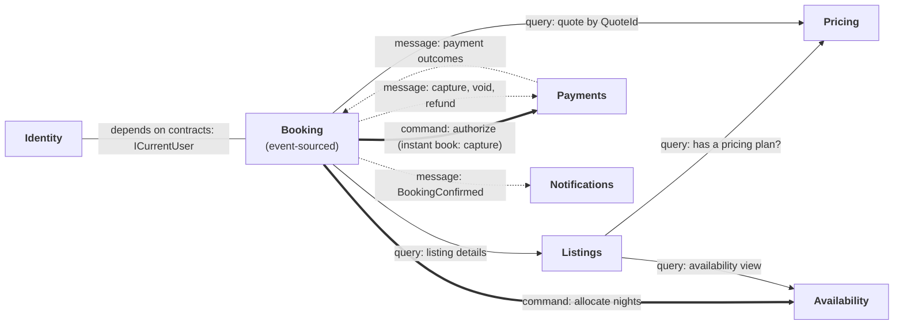

# Article 1 report: Designing and setting up Staybook

*Staybook, part 1 of 14 · Phase 1: Build a secure foundation · Code: tag [`article-01`](https://github.com/Alimurrazi/staybook-dotnet-reference-architecture/tree/article-01)*

> **This is the full development report for article 1**: every design decision, setup step, test, mistake and fix, written while building it. The published article is a shorter version drafted from it (see [`docs/articles/`](../articles/)). When the two differ in detail, this report is the complete record. Section 7 (the Claude Code harness) is published as its own short article, 1b.

Most architecture tutorials start with the architecture. They pick Clean Architecture, CQRS and event sourcing on page one, then go looking for a domain to apply them to. The result is usually a to-do list with four layers and a message bus.

This series goes the other way. We build **Staybook**, an Airbnb-style vacation rental backend, and let the domain tell us which patterns it needs and when. Event sourcing arrives in article 5 because bookings have a history that matters. Reliable messaging arrives in article 7 because we will have lost a search update and need to stop losing things. Sagas arrive in article 8 because a host has 24 hours to accept a request and the payment outcome is sometimes unknown. Nothing shows up before the problem it solves.

This first article does two things. It **designs** Staybook: what we're building, where its boundaries are, and which decisions we make now. Then it **sets up** a solution you can clone, start and test, with the boundaries enforced from the first commit. The step-by-step commands live in the [README](../../README.md); this article explains the decisions behind them.

---

## 1. The problem: what Staybook is, and what it isn't

Hosts list properties. Guests search, get a price, book and pay. The platform takes a fee and pays the host. Almost everyone has used a product like this, which is exactly why it makes a good teaching domain: you already know the requirements, so we can spend our time on the hard parts.

And it has hard parts:

- **Availability.** Two guests try to book the same nights at the same moment. Exactly one must win, every time, under load.
- **Money.** Prices are calculated from rates, discounts and fees. Every cent must add up, and a host changing the nightly rate must never change a price a guest was already quoted.
- **A long-running lifecycle.** A request to book waits up to 24 hours for the host. Meanwhile the guest's card is authorized, the nights are on hold, and either side can walk away.
- **External failure.** The payment provider times out. Did the authorization succeed or not? Treating a timeout as a failure can leave money held with no booking.

Those four problems are why the series exists. Everything else is deliberately small.

### Resist adding features

The guiding rule for the whole series is: **every feature must teach something.** Here is what stays and why:

| Feature | What it teaches | Article |
|---|---|---|
| Listings with a draft → published lifecycle | Aggregates, invariants, value objects | 2, 3 |
| Pricing plans with versions | `Money`, rounding, versioning | 2, 3 |
| Stored quotes | Immutable snapshots; never trusting a client's price | 2, 3, 4 |
| Search by city, guests and price | A read model updated from domain events | 3 |
| Roles and ownership | Authentication, policies, resource-based authorization | 4 |
| Instant book | Event sourcing | 5 |
| Availability calendar | Concurrency and double-booking prevention | 6 |
| Email notifications | The outbox, integration events, service extraction | 7, 11 |
| Request to book | Holds plus a 24-hour saga | 8 |
| Payments, then Stripe in test mode | Operation IDs, unknown outcomes, webhooks, idempotency | 5, 8, 9 |
| Cancellations, refunds, ledger, reconciliation | Financial correctness | 10 |

And what's cut: photo uploads, chat, wishlists, co-hosts, map search, seasonal pricing, taxes and currency conversion, real payouts. Each would add work without adding a lesson. There's no frontend either: you use the API through `.http` files, Scalar and tests.

### "Production-oriented", not "production-grade"

Staybook is a **production-oriented reference architecture**. It handles the problems a real system must handle, and it's honest about what an educational project can't promise:

- **No real money moves.** Stripe runs in test mode; payouts are simulated.
- **No operational recovery.** There's no production deployment, no backups, no tested restores.
- **No regulatory compliance.** GDPR comes up in a bonus article, but nothing here has had a legal review.
- **No security certification.** The threat model and tests reduce risk; they don't replace a penetration test.
- **No scale claims** beyond the load tests we actually run.

We'll come back to this list in article 14 and check how honest it was.

---

## 2. The design

### Discovering the boundaries through one scenario

You can draw boxes on a whiteboard and call them bounded contexts, but boxes drawn before you understand the domain tend to follow the database schema or the org chart. A better way is to walk through one real scenario and notice where the language and the rules change.

Here's the scenario that matters most: **a guest requests a stay, the host accepts, and the payment is captured.**

1. **A guest finds a listing.** It has a title, a city, a capacity, house rules and a check-in time. It must be *published*: drafts aren't bookable. This is the language of the **listing**: its details and its lifecycle.

2. **The guest asks what four nights will cost.** That involves a nightly rate, a cleaning fee, a weekly discount, minimum nights, a guest service fee and a host fee, with rounding rules for every line. The answer is a **quote**: stored by the server, immutable, valid for 30 minutes. This is a different language (rates, fees, versions, rounding) and it changes for different reasons than the listing does. A host edits the description and the price independently. That's **pricing**.

3. **The guest requests to book, with the quote's ID.** Never with a price: the client can't be trusted to send one. Now three things must happen while the guest waits:
   - the nights must be claimed so nobody else can take them: a **hold** in the listing's calendar;
   - the money must be reserved on the guest's card: an **authorization**;
   - the request itself must be recorded, with its 24-hour deadline.

   The first is about dates and conflicts: **availability**. The second is about a provider that can fail or time out: **payments**. The third is about the lifecycle of a reservation: **booking**.

4. **The host accepts within 24 hours.** The hold becomes a confirmed allocation, *then* the authorized money is captured. If the host doesn't answer, the hold expires and the authorization is voided. The **booking** coordinates all of this, but owns none of the dates or the money.

5. **Both get an email.** Nobody waits for it, and it must never block a booking: **notifications**.

6. Through all of it, someone is a **guest**, someone is a **host**, and some actions are only allowed to one of them: **identity**.

Each time the vocabulary shifted, so did the rules and the reasons for change. Those shifts are the boundaries. The words themselves become the **ubiquitous language**, used the same way in conversations, code and tests:

| Term | Meaning |
|---|---|
| Listing | A property a host offers; starts as a draft, bookable once published |
| Stay | A check-in and check-out date, measured in **nights** |
| Pricing plan | A listing's nightly rate, cleaning fee, weekly discount and minimum nights |
| Pricing version | Increases with every pricing-plan change; identifies which rules produced a quote |
| Quote | A stored, immutable price calculation with an owner and an expiry |
| Allocation | An authoritative claim on nights: a hold, a confirmed booking or a host block |
| Hold | An allocation that expires, placed while a request waits for the host |
| Authorization / capture / void | Money held, money taken, money released |
| Outcome | The result of a payment operation: succeeded, failed, pending or **unknown** |

### Bounded contexts and the context map

The scenario gives us seven modules:

| Module | Owns | Introduced |
|---|---|---|
| **Listings** | Listing details and lifecycle; the search read model | Skeleton now; built in 2 and 3 |
| **Pricing** | Pricing plans, versions, fees, stored quotes | Skeleton now; built in 2 and 3 |
| **Identity** | Users, roles, the current user | Skeleton now; built in 4 |
| **Booking** | The reservation lifecycle (event-sourced) | 5 |
| **Payments** | Payment operations and outcomes, the ledger | 5, 8 to 10 |
| **Availability** | Allocations: the only source of truth for dates | 6 |
| **Notifications** | Email | 7, extracted into a service in 11 |

The more interesting part is how they talk. Staybook allows exactly **three forms of cross-module communication**:

| Form | Used for | Example |
|---|---|---|
| **Query** through contracts (synchronous) | Reading another module's data | Listings asks Pricing whether a listing has a pricing plan |
| **Command** through contracts (synchronous) | **Only** steps the user waits for, always with a stable operation ID | Booking asks Availability to allocate nights |
| **Message** (asynchronous) | Everything else | `BookingConfirmed` → Notifications |

The middle row is the one people get wrong. Synchronous commands between modules feel natural, so they spread, and soon every module calls every other module in one long chain. Staybook allows them only where a human is waiting for the answer: allocating nights and authorizing the payment (or, for instant book, capturing it). Everything else is a message. And because a synchronous call can succeed while its response is lost, every command carries an **operation ID** so a retry returns the original result instead of doing the work twice. Article 6 tests exactly that.



*Thin arrows are queries, thick arrows are commands, dotted arrows are messages. The plain line is not communication at all: Booking depends on Identity's contracts (`ICurrentUser`), as every module will from article 4. The full context map, with notes on each relationship, is in [`docs/architecture.md`](../architecture.md).*

### Consistency boundaries: a first look

Not everything needs to be correct at the same instant. Deciding which operations need what is one of the most important design steps, and it's easy to skip:

| Operation | Must be | Why |
|---|---|---|
| Allocating nights | **Immediately and absolutely** correct | Two guests can't have the same nights. A database constraint enforces it (article 6) |
| Money: capture, refund, ledger | Immediately correct within the database; **never atomic** with the payment provider | You can't put Stripe inside a database transaction. The design records the intent first and resolves the outcome after (articles 5, 8 to 10) |
| A quote | Immediately correct, then immutable | A price shown to a guest never changes |
| "Publish requires a pricing plan" | An immediate check across modules, with a small accepted race | Article 3 tests and documents it |
| Search results | **Eventually** consistent | A listing appearing in search a second late harms nobody |
| Notifications | Eventually, at least once | An email a few seconds late is fine; a booking blocked by email is not |

Two rules fall out of this table, and they hold for the whole series:

- **A projection or view never decides anything that must be immediately correct.** Search can say a listing is available; only the allocation decides whether it is.
- **A provider timeout is never a failure.** The outcome is *unknown* until resolved.

### Modular monolith, not microservices

Seven modules with clear boundaries sound like seven microservices. They aren't, yet. Staybook is a **modular monolith**: one deployable application, one PostgreSQL database, with hard boundaries inside it ([ADR 1](../adr/0001-modular-monolith.md)).

Microservices would turn every boundary into a network call, a deployment and a new failure mode before we know the boundaries are right. The booking request alone (allocate nights, authorize payment, record the request) would need distributed coordination on day one. That's a lot of operational cost for a team of one and the load of an educational project.

But a monolith *without* boundaries erodes. The day Pricing code reads a Booking table to save a few lines, extraction becomes a rewrite. So the boundaries are real:

- each module owns one PostgreSQL **schema**, and no module reads another's tables;
- modules reference each other only through **Contracts** projects;
- **architecture tests** fail the test run when a boundary is crossed (section 5 below).

What would justify splitting a module out later? Independent scaling, a different release cadence, a separate team, or a failure that must not take the rest down. Article 11 extracts Notifications into its own service, partly to show that the boundaries held and partly to show what extraction really costs.

### Decided now, validated later

Some decisions are cheap to change and some aren't. It's worth saying which is which.

**Decided now:** the modular monolith, the module list, the three communication forms, schema-per-module, and the tools (Marten, Wolverine, PostgreSQL, Aspire). These shape every article; changing them later means rewriting published code.

**Validated before Phase 2:** the riskiest boundary in the design is the booking request: Booking and Availability must agree on whether nights are taken, even when a response is lost or a process crashes halfway. Before publishing this article, that transaction boundary is prototyped on a throwaway branch, with idempotent allocation and lost-response tests. If it doesn't hold, Phase 1's design changes now, while it's still cheap. The prototype is never merged; what it teaches goes into the plan and the ADRs, and articles 5 and 6 build the real thing properly.

### ADRs as the decision log

Every decision in this article has a short Architecture Decision Record in [`docs/adr/`](../adr/): the context, the decision, the alternatives considered and the consequences. This article starts five:

| ADR | Decision |
|---|---|
| [1](../adr/0001-modular-monolith.md) | Modular monolith over microservices |
| [2](../adr/0002-solution-structure.md) | One project per module, plus a Contracts project |
| [3](../adr/0003-wolverine-no-mediatr-no-automapper.md) | Wolverine instead of MediatR; no AutoMapper |
| [4](../adr/0004-marten-on-postgresql.md) | Marten on PostgreSQL for documents and events |
| [5](../adr/0005-logging.md) | Logging with `Microsoft.Extensions.Logging` and OpenTelemetry; no Serilog |

ADRs are cheap to write and expensive to skip. Six months from now, "why didn't we just use MediatR?" has a one-page answer, including the licensing facts as they were on the day of the decision.

---

## 3. Alternatives considered

| Instead of… | We could have… | Why we didn't |
|---|---|---|
| A modular monolith | Started with microservices | Network calls, deployments and distributed failure before the boundaries are proven |
| A modular monolith | Built a layered monolith with no module boundaries | Nothing would stop modules from reading each other's tables; extraction becomes a rewrite |
| One project per module + Contracts | One project per layer per module (`Booking.Domain`, `Booking.Application`, …) | 28+ projects for small modules. The compiler would enforce layers, but architecture tests do most of that job with far less noise ([ADR 2](../adr/0002-solution-structure.md)) |
| Wolverine | MediatR plus MassTransit | Two libraries for one job; both commercial or reciprocal-licensed in their current versions ([ADR 3](../adr/0003-wolverine-no-mediatr-no-automapper.md)) |
| Marten on PostgreSQL | EF Core plus a separate event store | Two databases, and the outbox can't share a transaction with the event store ([ADR 4](../adr/0004-marten-on-postgresql.md)) |
| Aspire | docker-compose, or installing PostgreSQL and Keycloak by hand | Aspire wires connection strings automatically and adds a telemetry dashboard; "clone and run one command" matters for readers |

---

## 4. The code

The setup is shown as decisions; the [README](../../README.md) has the commands.

### Solution structure

```
src/
  Staybook.AppHost/          Aspire: starts PostgreSQL, Keycloak and the API
  Staybook.ServiceDefaults/  OpenTelemetry, health checks
  Staybook.Api/              Host and composition root
  Staybook.SharedKernel/     Shared types (filled from article 2)
  Modules/
    Listings/   Staybook.Listings/   Staybook.Listings.Contracts/   CLAUDE.md
    Pricing/    Staybook.Pricing/    Staybook.Pricing.Contracts/    CLAUDE.md
    Identity/   Staybook.Identity/   Staybook.Identity.Contracts/   CLAUDE.md
tests/
  Staybook.ArchitectureTests/
```

Only three modules exist. Booking, Payments, Availability and Notifications arrive in the articles that need them. Empty skeletons for modules we won't touch for weeks would be infrastructure ahead of need: the very pitfall this article warns about.

Inside a module, layers are **folders**, not projects: `Domain/`, `Application/`, `Infrastructure/`, `Endpoints/`. The dependency rule between them (`Endpoints → Application → Domain`, `Infrastructure → Application, Domain`) is enforced by architecture tests.

### Tooling that fails loudly

Four small files make the build strict. Each one is cheaper now than later:

**`Directory.Build.props`** applies settings to every project at once:

```xml
<PropertyGroup Label="Analyzers and warnings">
  <TreatWarningsAsErrors>true</TreatWarningsAsErrors>
  <MSBuildTreatWarningsAsErrors>true</MSBuildTreatWarningsAsErrors>
  <AnalysisLevel>latest-recommended</AnalysisLevel>
  <EnforceCodeStyleInBuild>true</EnforceCodeStyleInBuild>
  <GenerateDocumentationFile>true</GenerateDocumentationFile>
  <WarningsNotAsErrors>$(WarningsNotAsErrors);NU1901;NU1902;NU1903;NU1904</WarningsNotAsErrors>
</PropertyGroup>
```

- **Warnings as errors**, because a warning nobody has to fix is a warning nobody reads. A codebase that starts with zero warnings can stay at zero; one that starts with fifty never gets back.
- **`MSBuildTreatWarningsAsErrors`** as well. `TreatWarningsAsErrors` alone covers compiler warnings, not warnings raised by MSBuild targets. I found that out when Aspire's `ASPIRE010` warning sailed through a "warnings as errors" build. More on that below.
- **The .NET analyzers at the recommended level**, plus `.editorconfig` style rules **enforced in the build**, not just shown in the IDE.
- One deliberate exception: **vulnerable-package advisories** (`NU1901`–`NU1904`) stay warnings. An advisory published next year must not stop a reader from building this tag.

**`Directory.Packages.props`** turns on **central package management**: every package version is set once, and a project that writes its own version fails with `NU1008`. Two projects can never drift onto different versions of Marten.

**`.editorconfig`** starts from `dotnet new editorconfig` and adds a short "Staybook overrides" section: file-scoped namespaces, no unused `using` directives, formatting checked in the build.

**`global.json`** pins the SDK band (10.0.100 or later) and switches `dotnet test` to the Microsoft Testing Platform, which xUnit v3 is built for.

I tested the strictness instead of trusting it: a throwaway project with a hard-coded package version, a possible null dereference, an unused `using` and a block-scoped namespace. Four mistakes, four build failures (`NU1008`, `CS8602`, `IDE0005`, `IDE0161`). Fixed, it built clean.

### Minimal infrastructure, wired by Aspire

The AppHost is the whole local environment in one file:

```csharp
var builder = DistributedApplication.CreateBuilder(args);

// One database for the whole monolith; each module owns its own schema inside it.
var postgres = builder.AddPostgres("postgres")
    .WithDataVolume("staybook-postgres-data");
var database = postgres.AddDatabase("staybook");

// Registered now so the topology is complete; configured in article 4.
builder.AddKeycloak("keycloak")
    .WithDataVolume("staybook-keycloak-data");

builder.AddProject<Projects.Staybook_Api>("api")
    .WithReference(database)
    .WaitFor(database);

builder.Build().Run();
```

`dotnet run --project src/Staybook.AppHost` starts PostgreSQL and Keycloak as containers, waits for the database, starts the API with the connection string injected, and opens a dashboard with logs, traces and metrics. Readers don't install a database, copy connection strings or configure an OpenTelemetry collector.

The API itself is a **composition root**: it wires infrastructure and lists the modules, and it holds no business logic:

```csharp
var builder = WebApplication.CreateBuilder(args);

builder.AddServiceDefaults();
builder.AddNpgsqlDataSource("staybook");

// Registered only. Modules add documents from article 3, Booking adds event streams in article 5.
builder.Services.AddMarten(_ => { }).UseNpgsqlDataSource();

// Registered only. Handlers arrive in article 3; durable messaging and the outbox in article 7.
builder.Host.UseWolverine();

builder.AddIdentityModule();
builder.AddListingsModule();
builder.AddPricingModule();

var app = builder.Build();

app.MapDefaultEndpoints();
app.MapIdentityEndpoints();
app.MapListingsEndpoints();
app.MapPricingEndpoints();

app.Run();
```

"Registered only" is deliberate. Marten has no documents yet and Wolverine has no handlers. Registering them now means article 3 adds features instead of plumbing, but nothing is configured ahead of the article that explains it.

### Module skeletons

Each module has one entry point for the host:

```csharp
public static class ListingsModule
{
    /// <summary>The PostgreSQL schema this module owns. No other module reads it.</summary>
    public const string Schema = "listings";

    public static IHostApplicationBuilder AddListingsModule(this IHostApplicationBuilder builder)
    {
        ArgumentNullException.ThrowIfNull(builder);

        // Services, Marten documents (in the schema above) and validators are registered here.
        return builder;
    }

    public static IEndpointRouteBuilder MapListingsEndpoints(this IEndpointRouteBuilder endpoints)
    {
        ArgumentNullException.ThrowIfNull(endpoints);

        // Endpoints from the Endpoints/ folder are mapped here.
        return endpoints;
    }
}
```

Empty methods look odd, but they are the seams. Article 3 fills them in, and the host never changes: it doesn't know what's inside a module, only that the module can register itself and map its endpoints.

### Basic observability

`Staybook.ServiceDefaults` is based on the Aspire template: OpenTelemetry for logs, metrics and traces, and health checks. The template also adds service discovery and resilient HTTP clients; Staybook removed them, because nothing calls another service over HTTP until Stripe in article 9. Two details are worth pointing out:

- **Health probes are filtered out of traces**, or they drown the real requests.
- **Health endpoints are mapped only in development.** `/health` exposes the database check; exposing it in production is a deployment decision, and deployment has its own series.

**Logging** is decided now, because it's already wired: code logs through .NET's own `ILogger<T>`, and OpenTelemetry sends the logs to the same dashboard as the traces and metrics, so every log line carries the trace ID of the request that wrote it. There's no Serilog. Its sinks used to be the reason to add it, and with OpenTelemetry as the export path they aren't needed ([ADR 5](../adr/0005-logging.md)). Logs are structured (`"Listing {ListingId} published"`, never string interpolation), and the domain doesn't log at all: it returns results and records events, and the application layer decides what's worth a log line.

That's all logging needs in article 1. It doesn't get an article of its own; it grows with the problems that need it. Article 3 fixes the conventions (`docs/logging-conventions.md`, source-generated `LoggerMessage` methods, one log entry per command). Article 8 makes an unknown payment outcome impossible to miss. Article 11 follows one booking's logs across two services. Article 13 makes sure no token or guest email ever reaches a log.

---

## 5. The tests

Article 1 has no business logic, so it has no business tests. It has something more basic: **architecture tests** that turn the boundaries from this article into rules the test run enforces. They use ArchUnitNET with xUnit v3 and Shouldly.

There are 37 of them, in three groups.

**Module boundaries:**

```csharp
[Theory]
[MemberData(nameof(ModulePairs))]
public void A_module_uses_another_module_only_through_its_contracts(string module, string other)
{
    Types().That().ResideInAssembly(ModuleAssembly(module))
        .Should().NotDependOnAny(Types().That().ResideInAssembly(ModuleAssembly(other)))
        .Because($"{module} may use {other} only through Staybook.{other}.Contracts")
        .Check(Architecture);
}
```

Alongside it:

- module and Contracts projects may **reference** only the shared kernel and Contracts projects (more on why below);
- Contracts never expose another module's implementation, or their own;
- each module declares a schema named after it. Today that only checks the module's `Schema` constant; it becomes a real check in article 3, when modules store their first documents and Marten has to use that schema;
- every folder under `src/Modules` is covered by the tests, so a new module can't quietly escape them.

**Layers:** `Domain` depends on no other layer and on no infrastructure framework (Marten, Wolverine, Npgsql, ASP.NET Core, EF Core, `Microsoft.Extensions.*` such as logging and configuration, `System.Net.Http`); `Application` depends on neither `Infrastructure` nor `Endpoints`; those two don't depend on each other; the shared kernel depends on no module and no framework. The layer rules find layers by namespace, so the build also requires namespaces to match folders (`IDE0130`): a file in `Domain/` can't hide in another namespace.

**The build guard**, which deserves its own story.

### The failing scenario: tests that pass for the wrong reason

While checking ArchUnitNET before starting, I found an open issue ([TNG/ArchUnitNET#498](https://github.com/TNG/ArchUnitNET/issues/498)): in **Release** builds, ArchUnitNET loses every dependency written inside an `async` method. The compiler turns an async method into a state machine; in Debug that state machine is a class, in Release a struct, and the loader only finds the class.

Think about what that means. Our handlers and endpoints will be async. A rule like "Listings must not depend on Pricing" would find no dependencies in async code and **pass**. Silently. Every boundary test green, every boundary unguarded.

So the architecture tests check themselves. A **canary** hides a forbidden dependency inside an async method:

```csharp
public static class AsyncCanary
{
    public static async Task<int> UseForbiddenDependencyAsync()
    {
        await Task.Yield();
        return ForbiddenDependency.Value;
    }
}
```

and a test asserts that ArchUnitNET **does** see it:

```csharp
[Fact]
public void A_dependency_inside_an_async_method_is_detected()
{
    var architecture = new ArchLoader().LoadAssemblies(typeof(AsyncCanary).Assembly).Build();

    Types().That().Are(typeof(AsyncCanary))
        .Should().DependOnAny(Types().That().Are(typeof(ForbiddenDependency)))
        .Because("if this isn't seen, the architecture tests can't see async code")
        .Check(architecture);
}
```

The rule is deliberately **positive** ("should depend on"). My first version asserted that the negative rule ("should not depend on") *fails*. That looks equivalent, but it isn't: a rule whose type filter matches nothing also fails, so if the canary type were ever renamed, the test would keep passing while checking nothing. The positive rule passes only if the canary is found *and* its dependency is seen.

A second guard fails if any analyzed assembly was built with optimizations. Then I tried both ways:

| Run | Result |
|---|---|
| `dotnet test` (Debug) | ✅ 37 of 37 pass |
| `dotnet test -c Release` | ❌ the guard and the canary fail. The bug is real, in our setup |
| Debug, with a real violation: Listings uses the `PricingModule` type inside an async method | ❌ `Staybook.Listings.Violation does depend on "Staybook.Pricing.PricingModule" because Listings may use Pricing only through Staybook.Pricing.Contracts` |

A test you have never seen fail is a test you don't know works. These three runs are the evidence.

### A violation the type rules can't see

The review of this article (section 7) found a hole in my own exercise. I had told readers to reference `Staybook.Pricing` from Listings and read `PricingModule.Schema`. That passed every test. `Schema` is a `const`, and the C# compiler copies a const's **value** into the code that uses it. The compiled Listings assembly contains the string `"pricing"` and no trace of `PricingModule`, so there is no dependency for ArchUnitNET to find. Meanwhile the forbidden project reference sits in the `.csproj`, ready for the next, less innocent use.

So one test reads the project files themselves:

```csharp
var forbidden = ProjectReferences(Path.Combine(RepositoryRoot(), "src", "Modules", module, project, $"{project}.csproj"))
    .Where(reference => reference != "Staybook.SharedKernel" && !reference.EndsWith(".Contracts", StringComparison.Ordinal))
    .ToList();

forbidden.ShouldBeEmpty($"{project} may reference only Staybook.SharedKernel and Contracts projects.");
```

The type rules catch what the code *uses*; this test catches what the project *may* use. You need both.

**One more honest note:** most layers are still empty, so rules like "Domain depends on no framework" have nothing to check yet. They're marked `WithoutRequiringPositiveResults()` for now. The canary is what tells us they'll bite once code arrives in article 2.

---

## 6. What can go wrong

**Designing around technology instead of the domain.** The boundaries in this article came from walking through a booking, not from a template. If your modules are named `Data`, `Services` and `Api`, they follow the code's technology, not the business, and every feature touches all of them.

**Starting with microservices.** Distributed systems are harder to change than monoliths, and boundaries are hardest to get right at the start. Get them right in-process first; split when you have a reason.

**Setting up infrastructure before it's needed.** Staybook registers Marten and Wolverine but configures nothing; it creates three module skeletons, not seven. Keycloak is the one exception: it's registered in article 1 so the topology is complete, but nothing uses it until article 4. Every piece of infrastructure has to be understood, upgraded and debugged. Pay for it when it pays you back.

**A shared kernel that becomes a dumping ground.** Every module depends on `Staybook.SharedKernel`, so everything in it is coupled to everything. It's empty today. It will get `Money`, `DateRange`, `Result` and a few base types in article 2, and a type moves there only when two modules genuinely need it. An architecture test already makes sure it depends on no module and no framework.

**Things that went wrong while building this article:**

- **The API built, but didn't start.** Wolverine 6 no longer ships its runtime code compiler in the main package. With no handlers at all, the host still failed at startup: *"no IAssemblyGenerator (Roslyn) is registered"*. The fix is the `WolverineFx.RuntimeCompilation` package, recorded in [ADR 3](../adr/0003-wolverine-no-mediatr-no-automapper.md). The lesson: a passing build proves the code compiles, not that the application starts. Run it.
- **A warning slipped past "warnings as errors".** Aspire's `ASPIRE010` (the AppHost uses NuGet-delivered orchestration instead of a separately installed Aspire CLI) is raised by an MSBuild target, which `TreatWarningsAsErrors` doesn't cover. Adding `MSBuildTreatWarningsAsErrors` closed the gap; the warning itself is suppressed with a comment, because `dotnet run` without an extra CLI is what readers need.
- **Keycloak's Aspire integration is still a preview package.** It works, but it's a dependency to watch until article 4.

---

## 7. Building this with Claude Code

Staybook is built with [Claude Code](https://claude.com/claude-code), and the harness is part of the repository. It's optional: you can ignore `.claude/` entirely and the code works the same. But a reference architecture developed with an AI assistant should show exactly how the assistant is constrained, so here is every piece and why it exists.

The idea in one line: **`CLAUDE.md` guides; tests, analyzers and hooks enforce.** Instructions are suggestions to a model. A failing build is not.

### `CLAUDE.md` files: written before any code

The root [`CLAUDE.md`](../../CLAUDE.md) was the first file in the repo after the plan. It holds what a new team member would need on day one: the commands, the solution layout, the dependency rule, the three communication forms, the rules that must never break (no module reads another's tables; the server always calculates prices; a payment timeout is never a failure; `TimeProvider`, never `DateTime.UtcNow`), the conventions and the commit rules.

Each module has its own `CLAUDE.md` next to its code, which Claude Code loads only when it works in that folder. Pricing's says, among other things:

```markdown
- **The server always calculates prices.** No command or endpoint accepts a price; clients send a `QuoteId`.
- A quote is **immutable** once created: line items, currency, pricing version, owner and expiry. Changing the plan never changes an existing quote.
- Every percentage line is rounded on its own to the minor unit, half away from zero; totals are sums of rounded lines.
- The two pricing examples in plan section 5 are tests with their exact numbers. If a change breaks them, the change is wrong.
```

Writing these before any code forces you to say what the architecture *is* in plain words. If you can't write the rule down, you can't expect a model, or a colleague, to follow it.

### Permissions: `.claude/settings.json`

Shared with the team, checked into the repo:

- **Allowed without asking:** `dotnet build`, `test`, `format` and `restore`; read-only `git` commands (`status`, `diff`, `log`, `show`, `branch --show-current` and `--list`), plus `git add`, `git commit` and `git switch -c` to start a branch; `docker ps` and `logs`; starting the AppHost.
- **Denied:** reading or editing `.env` files, `secrets.json`, certificates and keys; `git push --force`; `git reset --hard`.
- **Everything else asks**, including `git push` and `dotnet add package`. Adding a library is a decision, not a keystroke.

### Hooks: rules the model can't skip

Hooks are commands Claude Code runs at fixed points. Staybook's are **C# file-based apps** (`dotnet run hook.cs`), so the only runtime they need is the .NET SDK you already have. The first run of each compiles it (about 30 to 40 seconds); after that they start in under a second.

| Hook | When | What it does |
|---|---|---|
| `guard-edits.cs` | Before any file edit | Blocks edits to generated code (`bin/`, `obj/`, `*.g.cs`, Marten and Wolverine generated code), to DbUp scripts git already tracks (a database may have run them; add a new script instead), and to secrets |
| `build-after-edit.cs` | After any C# or MSBuild edit | Fixes whitespace in the file, then builds the owning project. With warnings as errors, analyzer and style problems surface here, and the errors go straight back to Claude |
| `test-before-stop.cs` | When Claude is about to stop | Runs the tests affected by the branch's changes. If they fail, Claude keeps working and gets the failures |

The Stop hook guards against loops: if Claude is already continuing because of the hook, it lets Claude stop, so a test it can't fix never turns into an endless cycle.

They earned their place while building this very article:

- The build hook caught a mistake of mine within seconds: I registered the three modules in `Program.cs` and the `using` directives didn't land. Six errors, fixed before I moved on.
- It also exposed a bad formatting default (a blank line between every `using` group) the first time it reformatted a file.

And one hook didn't. For a while the harness had two **commit hooks**: one reminded Claude to commit once uncommitted work grew past 12 files or 400 lines, and the Stop hook also refused to finish while finished work was uncommitted. They did their job, and the history is a clean series of steps. But a hook can't tell *whose* changes are uncommitted. When the author started drafting their own text in the repo, the Stop hook complained about that file at every single stop. Both were removed; committing each finished step is now a rule in `CLAUDE.md`, not a gate. The lesson: a hook should enforce only what it can judge correctly every time. Builds and tests qualify. "Is this work finished, and is it mine?" doesn't.

### Skills: scaffolding with the rules built in

Four skills in `.claude/skills/`, invoked as slash commands:

| Skill | Creates | Used from |
|---|---|---|
| `/new-value-object` | An immutable, always-valid value object, test-first | Article 2 |
| `/new-aggregate` | An aggregate with invariants, domain errors and events, starting from "which rules must hold in one transaction?" | Article 2 |
| `/new-command` | A command or query with its Wolverine handler and validator | Article 3 |
| `/new-endpoint` | A Minimal API endpoint following the API conventions, with its authorization policy declared | Article 3 |

A skill isn't a code template. It's a procedure: where the file goes, which questions to answer first, which tests to write before the code, and which subagent checks the result. The templates come from the first real examples in articles 2 and 3.

### Subagents: a reviewer and a test writer

- **`architecture-reviewer`** reads the change against the root and module `CLAUDE.md` files and the plan, and reports violations, risks and suggestions with `file:line`. It can't edit anything; it only reports.
- **`test-writer`** writes failing tests before the implementation exists: the "red" step of test-driven development. Its job ends when the tests compile and fail *for the right reason*. It's first used in article 2.

Before this article went to its human reviewer, `architecture-reviewer` reviewed the whole branch, and it was worth it. Among fifteen findings, it showed that my "break something on purpose" exercise broke nothing (the `const` story in section 5), that the Stop hook looked for module tests in a folder the plan doesn't use (so it would never have run article 2's tests), that two template packages had arrived ahead of the article that needs them, and that the `git branch *` permission also allowed `git branch -D`. Every finding was checked against the plan before anything changed: twelve applied, two applied in part, and the rest went to the author as decisions.

That's the honest version of "watching the architecture tests catch Claude's first boundary violation". In this article, Claude made no accidental boundary violation for the tests to catch; the violations shown above were deliberate experiments. What the harness did catch were Claude's other mistakes, through the build hook, the Stop hook and the reviewer.

### MCP servers: none yet

The plan allows MCP servers "only when they earn their place". Nothing has earned it: `git` and `gh` already cover GitHub, and there's no data worth querying. A read-only PostgreSQL server becomes useful once article 3 stores data.

### The working loop

> plan → write the failing test → implement → hooks and tests verify → commit → `architecture-reviewer` → human review

The order matters. The cheap checks run on every edit and every stop. The expensive judgment (does this design make sense?) is left to the reviewer subagent and then to a human, once the mechanical problems are already gone.

---

## 8. Try it yourself

You need the .NET 10 SDK and Docker.

```bash
git clone https://github.com/Alimurrazi/staybook-dotnet-reference-architecture.git
cd staybook-dotnet-reference-architecture
git checkout article-01

dotnet build Staybook.slnx
dotnet test --solution Staybook.slnx
dotnet run --project src/Staybook.AppHost
```

| Check | Expected |
|---|---|
| `dotnet test` | 37 tests pass |
| The Aspire dashboard (open the login URL printed in the console) | `postgres`, `staybook`, `keycloak` and `api` running |
| `http://localhost:5174/health` | `Healthy` (includes the PostgreSQL check) |
| `http://localhost:5174/alive` | `Healthy` |

Then break something on purpose:

1. Add a project reference from `Staybook.Listings` to `Staybook.Pricing`, and use `typeof(Staybook.Pricing.PricingModule)` inside an async method in Listings. Run the tests: two fail, one for the project reference and one for the type dependency. Then use only `PricingModule.Schema` instead, and see that just the project-reference test fails (section 5 explains why).
2. Run `dotnet test -c Release` and watch the two guard tests explain why they fail.

**Known limitations of this tag:** there are no features yet besides health checks; there's no authentication (Keycloak runs but isn't configured); there's no CI workflow yet; and Keycloak's Aspire integration is a preview package. The [README](../../README.md) lists them all.

**Next:** in article 2 we model the domain, the inner circle: `Money` that never loses a cent, a `Listing` aggregate with a real lifecycle, a `PricingPlan` with versions and an immutable `Quote`. Pure C#, no database, no HTTP, and every rule a test.

---

*Staybook is inspired by Airbnb. It isn't affiliated with Airbnb and uses none of its branding. Thanks to [jeangatto/ASP.NET-Core-Clean-Architecture-CQRS-Event-Sourcing](https://github.com/jeangatto/ASP.NET-Core-Clean-Architecture-CQRS-Event-Sourcing): reviewing it shaped this series, and its gaps become teaching examples in later articles.*
